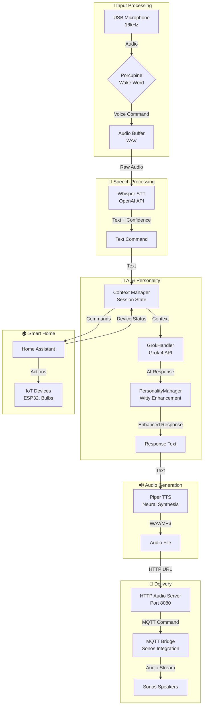

# Alicia Project README

## Overview
Alicia is an AI-powered home automation system designed to revolutionize smart living by providing a personalized, privacy-focused alternative to existing voice assistants. The project, also referred to as GrokHome in planning documents, aims to create a scalable, open-source platform starting from a hobby prototype and expanding to enterprise applications. Key goals include local processing for privacy, modular design for future-proofing, and seamless integration with existing hardware like Sonos speakers and WiFi bulbs.

## High-Level Diagram
The system processes voice input from a USB microphone through Porcupine wake word detection, converts speech to text via Whisper STT, maintains conversation context, processes commands through Grok-4 API with personality enhancement, generates natural speech via Piper TTS, and delivers audio through MQTT to Sonos speakers. IoT devices interact bidirectionally through MQTT and Home Assistant.



## Project Outline and Approach
### Hardware
- **Core Device**: Raspberry Pi 5 (or 4) for processing.
- **Audio I/O**: USB mic (e.g., Blue Yeti Nano) for input; existing Sonos speakers for output.
- **Sensors/Actuators**: ESP32 boards for sensors (e.g., MH-Z19 for CO2); compatible WiFi bulbs (e.g., TP-Link Kasa).
- **Consumer Focus**: Off-the-shelf components, total basic kit under $99, leveraging existing gear.

### Software
- **Base OS**: Home Assistant (HA) core.
- **AI Layer**: Open models like Llama 3 via Ollama, fine-tuned on user data.
- **Voice Engine**: Porcupine for wake word, Whisper for STT, Piper for TTS.
- **Core Features**: Device controls, utilities, conversational AI.

### Tech Stack
- **Backend**: Python (Flask/FastAPI), Node.js.
- **Database**: SQLite local, PostgreSQL for scale (with pgvector for embeddings).
- **Networking**: MQTT, Docker.
- **Security**: HTTPS, JWT, local-first.

### Integrations and APIs
- Smart devices via HA add-ons (Sonos, Spotify, Hue).
- Optional external APIs for queries (Wolfram Alpha).

### Futureproofing
- Modular plug-in architecture.
- OTA updates via GitHub.
- Scalable from single Pi to Kubernetes clusters.

### Phone App
- Cross-platform app for remote control, sensor feeds, and customization.

### Monetization
- Open-source core with paid DIY guides, kits, and later subscriptions/enterprise licensing.

### Prototyping Rollout
- Step 1: Personal prototype.
- Step 2: Family deployment.
- Step 3: Open-source release and business pivot.

### Prototype Costing
| Component | Description | Estimated Price (USD) | Notes |
|-----------|-------------|-----------------------|-------|
| Raspberry Pi 5 (4GB) | Core brain | $60 | |
| Blue Yeti Nano USB Mic | Voice input | $70 | |
| ESP32 Board | Sensors | $8 | |
| MH-Z19 CO2 Sensor | Health alerts | $28 | |
| Sonos Speakers | Output | $0 | Existing |
| Wireless Lightbulb | Lights | $0 | Existing |
| Philips Hue Bridge (optional) | Scaling lights | $65 | |
| **Total (Core)** | | **$166** | |

## Docker Configuration for PostgreSQL
Alicia uses PostgreSQL with pgvector for storing memories and conversations with vector embeddings.

### docker-compose.yml
Aligned with the provided configuration in `postgres/docker-compose.yml`:

```yaml
services:
  postgres:
    image: postgres:15
    container_name: alicia_postgres
    restart: unless-stopped
    environment:
      POSTGRES_DB: alicia_db
      POSTGRES_USER: alicia_user
      POSTGRES_PASSWORD: test123  # Updated for documentation; use secure password in production
      PGDATA: /var/lib/postgresql/data
    volumes:
      - ./pg-data:/var/lib/postgresql/data
      - ./init-scripts:/docker-entrypoint-initdb.d
    ports:
      - "5432:5432"
    healthcheck:
      test: ["CMD-SHELL", "pg_isready -U alicia_user -d alicia_db"]
      interval: 30s
      timeout: 10s
      retries: 3
      start_period: 30s
    networks:
      - alicia_network

networks:
  alicia_network:
    driver: bridge
```

### Environment Variables
Create a `.env` file:
```
POSTGRES_PASSWORD=test123  # For documentation; replace with secure value
POSTGRES_DB=alicia_db
POSTGRES_USER=alicia_user
VECTOR_DIMENSION=768
```

### Database Schema
- **memories**: Stores messages with vector embeddings.
- **conversations**: Groups messages.

### Setup Instructions
1. Copy `.env.example` to `.env` and adjust.
2. Run `docker-compose up -d`.
3. Verify with `docker-compose exec postgres psql -U alicia_user -d alicia_db -c "\dt"`.

### Additional Commands
- Stop: `docker-compose down`
- Logs: `docker-compose logs -f postgres`
- Access: `docker-compose exec postgres psql -U alicia_user -d alicia_db`
- Backup: `docker-compose exec postgres pg_dump -U alicia_user -d alicia_db > backup.sql`

### Security
- Use strong passwords.
- Limit exposure.
- Regular backups.

For full details, refer to original guides. This README consolidates key information for quick reference.

## Resources
- [PostgreSQL Docs](https://www.postgresql.org/docs/)
- [pgvector GitHub](https://github.com/pgvector/pgvector)
- [Docker Compose Docs](https://docs.docker.com/compose/)
