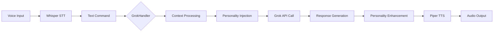

# Phase 4: Grok Integration
**Complete Grok-4 API Integration Guide**

## Overview

This chapter documents the complete integration of Grok-4 API into the Alicia smart home system, providing advanced AI capabilities with context management, rate limiting, and personality-driven responses.

## 🎯 Integration Goals

- **Advanced AI Processing**: Leverage Grok-4's 256k context window for intelligent conversation
- **Context Awareness**: Maintain conversation history and device state context
- **Rate Limiting**: Implement robust rate limiting for API stability
- **Error Handling**: Comprehensive error handling and fallback mechanisms
- **Security**: Secure API key management without exposing credentials

## 🏗️ System Architecture

### GrokHandler Component

The `GrokHandler` class provides OpenAI-compatible interface to Grok models:

```python
class GrokHandler:
    def __init__(self, api_key: str, model: str = "grok-4-0709", rate_limit: float = 1.0):
        self.api_key = api_key
        self.model = model
        self.client = AsyncOpenAI(api_key=api_key, base_url="https://api.x.ai/v1")
        self.context_manager = ConversationContext()
        self.prompt_generator = PromptGenerator(self.context_manager)
```

### Key Components

#### 1. ConversationContext
Manages conversation history and session state:

```python
class ConversationContext:
    def __init__(self, session_id: str = None):
        self.session_id = session_id or str(uuid.uuid4())
        self.conversation_history: List[Dict[str, Any]] = []
        self.device_context: Dict[str, Any] = {}
        self.max_context_length = 4000  # Tokens
```

#### 2. PromptGenerator
Creates contextual prompts with personality injection:

```python
class PromptGenerator:
    def __init__(self, context_manager: ConversationContext):
        self.context_manager = context_manager
        self.system_prompt = self._build_system_prompt()
```

## 🔧 Configuration

### Environment Variables

Create a `.env` file with the following variables:

```bash
# Grok API Configuration
XAI_API_KEY=your_xai_api_key_here
GROK_MODEL=grok-4-0709
GROK_RATE_LIMIT=1.0

# Context Management
MAX_CONTEXT_LENGTH=4000
SESSION_TIMEOUT=3600
```

### Assistant Configuration

Update `voice-processing/config/assistant_config.yaml`:

```yaml
grok:
  model: "grok-4-0709"
  rate_limit: 1.0
  max_context_length: 4000
  temperature: 0.7
  max_tokens: 200

context:
  session_timeout: 3600
  max_history: 50
  device_tracking: true

personality:
  enabled: true
  wit_level: 0.7
  sarcasm_level: 0.5
  helpfulness_level: 0.9
```

## 🚀 Implementation

### Basic Integration

```python
from grok_handler import create_grok_handler

# Initialize Grok handler
grok = create_grok_handler()

# Process a voice command
response = await grok.process_command("Turn on the living room lights")
print(response)  # "Absolutely! The living room lights are now on."
```

### Context-Aware Processing

```python
# Update device context
grok.update_device_context({
    "living_room_lights": "on",
    "temperature": 72,
    "time": "evening"
})

# Process contextual command
response = await grok.process_command("It's getting chilly in here")
print(response)  # "I notice it's 72°F. Should I adjust the thermostat?"
```

## 📊 Rate Limiting

### Grok-4 Limits

| Limit Type | Value | Description |
|------------|-------|-------------|
| Requests per minute | 480 | Maximum API calls per minute |
| Requests per hour | 20,000 | Maximum API calls per hour |
| Tokens per minute | 2,000,000 | Maximum tokens processed per minute |
| Context window | 256,000 | Maximum context length |

### Implementation

```python
async def _rate_limit(self):
    """Enhanced rate limiting with per-minute and per-hour limits"""
    current_time = time.time()

    # Check per-minute request limit
    recent_requests = [t for t in self.request_times if current_time - t < 60]
    if len(recent_requests) >= self.max_requests_per_minute:
        wait_time = 60 - (current_time - recent_requests[0])
        await asyncio.sleep(wait_time)

    # Check token usage
    recent_tokens = sum(tokens for t, tokens in self.token_usage if current_time - t < 60)
    if recent_tokens >= self.max_tokens_per_minute:
        wait_time = 60 - (current_time - self.token_usage[0][0])
        await asyncio.sleep(wait_time)
```

## 🧪 Testing Procedures

### Basic Connectivity Test

```python
import asyncio
from grok_handler import create_grok_handler

async def test_grok_connection():
    grok = create_grok_handler()

    # Test basic connection
    response = await grok.process_command("Hello, can you hear me?")
    print(f"Grok response: {response}")

    # Test context management
    grok.update_device_context({"lights": "on"})
    response = await grok.process_command("What's the status of the lights?")
    print(f"Contextual response: {response}")

asyncio.run(test_grok_connection())
```

### Rate Limiting Test

```python
async def test_rate_limiting():
    grok = create_grok_handler()

    # Test rapid requests
    for i in range(10):
        try:
            response = await grok.process_command(f"Test command {i}")
            print(f"Request {i}: Success")
        except Exception as e:
            print(f"Request {i}: Rate limited - {e}")
        await asyncio.sleep(0.1)  # Small delay between requests

asyncio.run(test_rate_limiting())
```

### Context Management Test

```python
async def test_context_management():
    grok = create_grok_handler()

    # Simulate conversation
    commands = [
        "Turn on the kitchen light",
        "What's the temperature?",
        "Set the thermostat to 75 degrees",
        "What's the status of all devices?"
    ]

    for command in commands:
        response = await grok.process_command(command)
        print(f"Command: {command}")
        print(f"Response: {response}")
        print("---")

asyncio.run(test_context_management())
```

## 🔒 Security Considerations

### API Key Management

**NEVER** commit API keys to version control:

```bash
# ❌ WRONG - Never do this
echo "XAI_API_KEY=sk-1234567890abcdef" >> .env
git add .env
git commit -m "Add API key"

# ✅ CORRECT - Use environment variables
export XAI_API_KEY=your_secure_key_here
echo "XAI_API_KEY=$XAI_API_KEY" >> .env
echo ".env" >> .gitignore
```

### Secure Configuration

```python
# Secure key loading
import os
from dotenv import load_dotenv

load_dotenv()

api_key = os.getenv("XAI_API_KEY")
if not api_key:
    raise ValueError("XAI_API_KEY environment variable not set")

# Validate key format
if not api_key.startswith("xai-"):
    raise ValueError("Invalid XAI API key format")
```

## 🐛 Error Handling

### Common Error Scenarios

```python
async def process_command_with_fallback(self, command: str) -> str:
    """Process command with comprehensive error handling"""
    try:
        return await self.process_command(command)
    except httpx.TimeoutException:
        logger.error("Grok API timeout")
        return "I'm having trouble connecting right now. Please try again."
    except httpx.HTTPStatusError as e:
        if e.response.status_code == 429:
            logger.warning("Rate limit exceeded")
            return "I'm processing too many requests. Please wait a moment."
        elif e.response.status_code == 401:
            logger.error("Invalid API key")
            return "Authentication error. Please check API configuration."
        else:
            logger.error(f"HTTP error: {e.response.status_code}")
            return "I'm experiencing technical difficulties."
    except Exception as e:
        logger.error(f"Unexpected error: {e}")
        return "Something went wrong. Let me try a different approach."
```

### Fallback Mechanisms

```python
class FallbackHandler:
    """Handle fallback responses when Grok is unavailable"""

    def __init__(self):
        self.basic_responses = {
            "light": "I'll help you with the lights. Please try again.",
            "temperature": "For temperature control, please try your request again.",
            "status": "Let me check the current status for you.",
            "default": "I'm here to help! Please try your request again."
        }

    def get_fallback_response(self, command: str) -> str:
        """Generate appropriate fallback response"""
        command_lower = command.lower()

        for key, response in self.basic_responses.items():
            if key in command_lower:
                return response

        return self.basic_responses["default"]
```

## 📈 Performance Monitoring

### Metrics Tracking

```python
class GrokMetrics:
    def __init__(self):
        self.request_count = 0
        self.error_count = 0
        self.average_response_time = 0
        self.token_usage = []

    def record_request(self, response_time: float, tokens_used: int):
        self.request_count += 1
        self.average_response_time = (
            (self.average_response_time * (self.request_count - 1)) + response_time
        ) / self.request_count
        self.token_usage.append(tokens_used)

    def get_metrics(self) -> Dict[str, Any]:
        return {
            "total_requests": self.request_count,
            "error_rate": self.error_count / max(self.request_count, 1),
            "avg_response_time": self.average_response_time,
            "total_tokens": sum(self.token_usage),
            "avg_tokens_per_request": sum(self.token_usage) / max(len(self.token_usage), 1)
        }
```

## 🔄 Integration with Voice Pipeline

### Complete Voice Flow



### Voice Processing Integration

```python
class VoicePipeline:
    def __init__(self):
        self.grok_handler = create_grok_handler()
        self.personality_manager = create_personality_manager()

    async def process_voice_command(self, audio_data: bytes) -> bytes:
        """Complete voice processing pipeline"""

        # 1. Speech to Text
        text_command = await self.stt.process_audio(audio_data)

        # 2. Context and Personality Processing
        enhanced_prompt = self.personality_manager.get_personality_prompt(
            self.grok_handler.prompt_generator.system_prompt,
            text_command,
            self.grok_handler.context_manager.device_context
        )

        # 3. Grok Processing
        ai_response = await self.grok_handler.process_command(text_command)

        # 4. Personality Enhancement
        witty_response = self.personality_manager.get_witty_response("acknowledgment")

        # 5. Text to Speech
        audio_response = await self.tts.generate_speech(ai_response)

        return audio_response
```

## 📋 Testing Checklist

### Integration Tests
- [ ] API key validation
- [ ] Basic connectivity test
- [ ] Rate limiting verification
- [ ] Context management test
- [ ] Error handling validation
- [ ] Performance benchmarking

### Voice Pipeline Tests
- [ ] End-to-end voice processing
- [ ] Personality injection verification
- [ ] Context awareness testing
- [ ] Fallback mechanism validation
- [ ] Multi-turn conversation testing

### Security Tests
- [ ] API key protection verification
- [ ] Environment variable security
- [ ] Error message sanitization
- [ ] Rate limit enforcement

## 🚀 Deployment

### Production Configuration

```yaml
# production-config.yaml
grok:
  model: "grok-4-0709"
  rate_limit: 2.0  # Higher for production
  max_context_length: 8000
  temperature: 0.7
  timeout: 30

monitoring:
  enabled: true
  metrics_endpoint: "/metrics"
  health_check_interval: 60

logging:
  level: "INFO"
  format: "json"
  file: "/var/log/alicia/grok.log"
```

### Docker Integration

```dockerfile
# Dockerfile.grok
FROM python:3.11-slim

COPY requirements.txt .
RUN pip install -r requirements.txt

COPY grok_handler.py personality_manager.py ./
COPY config/production-config.yaml ./config/

EXPOSE 8001

CMD ["python", "-m", "grok_handler"]
```

## 📚 References

- [Grok API Documentation](https://docs.x.ai/)
- [OpenAI API Compatibility](https://platform.openai.com/docs/api-reference)
- [AsyncIO Best Practices](https://docs.python.org/3/library/asyncio.html)
- [Rate Limiting Patterns](https://stripe.com/blog/rate-limiters)

## 🎯 Next Steps

- [ ] Implement advanced context compression
- [ ] Add conversation summarization
- [ ] Integrate with Home Assistant device states
- [ ] Implement conversation memory persistence
- [ ] Add multi-modal input support

---

**🎉 Grok-4 integration complete! Alicia now has advanced AI capabilities with personality-driven responses.**

*This integration provides the foundation for intelligent, context-aware smart home interactions with natural language processing and witty personality responses.*
