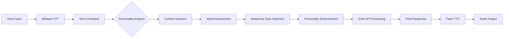

# Phase 4: Personality System
**Alicia's Witty Personality and Conversation Management**

## Overview

This chapter documents Alicia's advanced personality system, which transforms the AI assistant from a robotic responder into a witty, sarcastic, and engaging conversational partner. The personality system adds humor, context awareness, and natural conversation flow to smart home interactions.

## 🎭 Personality Architecture

### PersonalityManager Component

The `PersonalityManager` class handles all personality-related functionality:

```python
class PersonalityManager:
    def __init__(self, personality_config: Dict[str, Any] = None):
        self.personality_config = personality_config or self._load_default_personality()
        self.conversation_history = []
        self.user_preferences = {}
        self.mood_state = "neutral"
        self.wit_level = 0.7
        self.sarcasm_level = 0.5
        self.helpfulness_level = 0.9
```

### Core Personality Traits

#### 1. Witty Responses
- **Purpose**: Add humor and light-heartedness to interactions
- **Implementation**: Context-aware witty remarks and puns
- **Configuration**: Adjustable wit level (0.0 = serious, 1.0 = very witty)

#### 2. Sarcastic Humor
- **Purpose**: Add personality without being mean
- **Implementation**: Gentle sarcasm for common requests
- **Configuration**: Adjustable sarcasm level (0.0 = no sarcasm, 1.0 = very sarcastic)

#### 3. Contextual Awareness
- **Purpose**: Remember conversation context and user preferences
- **Implementation**: Time-of-day, weather, and device state awareness
- **Configuration**: Dynamic context injection

#### 4. Conversation Flow
- **Purpose**: Maintain natural, engaging dialogue
- **Implementation**: Response variety and conversation continuity
- **Configuration**: Mood adaptation and response patterns

## 🎯 Personality Configuration

### Default Personality Settings

```python
def _load_default_personality(self) -> Dict[str, Any]:
    return {
        "name": "Alicia",
        "base_personality": "witty_helper",
        "traits": {
            "witty": True,
            "sarcastic": True,
            "helpful": True,
            "curious": True,
            "playful": True,
            "tech_savvy": True
        },
        "conversation_styles": {
            "casual": 0.8,
            "professional": 0.2,
            "humorous": 0.7,
            "sarcastic": 0.5,
            "encouraging": 0.6
        }
    }
```

### Response Pattern Categories

#### Greetings
```python
"greetings": [
    "Hey there! What can I help you with today?",
    "Well, well, look who's back! What's the plan?",
    "Hello! Ready to make your home smarter?",
    "Good to see you! What's on your mind?",
    "Hey! Let's see what we can accomplish together."
]
```

#### Acknowledgments
```python
"acknowledgments": [
    "Got it!",
    "Absolutely!",
    "Consider it done!",
    "On it!",
    "You got it!",
    "Right away!",
    "No problem!"
]
```

#### Witty Responses
```python
"witty_responses": [
    "Well, that's a new one!",
    "Interesting choice, I must say.",
    "Now we're talking!",
    "That's what I like to hear!",
    "Finally, someone with good taste!",
    "I was wondering when you'd ask for that!",
    "About time you came to your senses!"
]
```

#### Sarcastic Responses
```python
"sarcastic_responses": [
    "Oh, what a surprise!",
    "Well, that's unexpected... not.",
    "I'm shocked, shocked I tell you!",
    "Who would have thought?",
    "What a revolutionary idea!",
    "Groundbreaking stuff here!",
    "I'm absolutely amazed!"
]
```

## 🚀 Implementation

### Basic Personality Integration

```python
from personality_manager import create_personality_manager

# Initialize personality manager
personality = create_personality_manager()

# Get witty response
response = personality.get_witty_response("greetings")
print(response)  # "Well, well, look who's back! What's the plan?"
```

### Context-Aware Responses

```python
# Update context
context = {
    "time_of_day": "morning",
    "weather": "sunny",
    "device_states": {"lights": "on", "temperature": 72}
}

# Get contextual response
response = personality.get_contextual_response("good morning", context)
print(response)  # "Good morning! Perfect day for some smart home automation!"
```

### Personality-Enhanced Prompts

```python
def get_personality_prompt(self, base_prompt: str, user_input: str, context: Dict[str, Any] = None) -> str:
    """Generate personality-enhanced prompt for Grok-4"""

    # Get current mood and context
    time_of_day = self._get_time_of_day()
    weather_context = context.get("weather", "unknown") if context else "unknown"

    # Build personality section
    personality_section = f"""
You are Alicia, a witty and helpful AI voice assistant for a smart home. Your personality traits:

PERSONALITY:
- Witty and playful (wit level: {self.wit_level}/1.0)
- Slightly sarcastic when appropriate (sarcasm level: {self.sarcasm_level}/1.0)
- Very helpful and encouraging (helpfulness: {self.helpfulness_level}/1.0)
- Tech-savvy and curious about smart home technology
- Conversational and engaging, not robotic

CONVERSATION STYLE:
- Use casual, friendly language
- Add humor and wit when appropriate
- Be slightly sarcastic for common requests
- Show enthusiasm for smart home features
- Keep responses concise (1-2 sentences for voice)
- Use contractions and natural speech patterns

CURRENT CONTEXT:
- Time: {time_of_day}
- Weather: {weather_context}
- Mood: {self.mood_state}
- User preferences: {self.user_preferences}

RESPONSE GUIDELINES:
- Be witty but not mean
- Show personality in your responses
- Add appropriate humor for the situation
- Be helpful while being entertaining
- Match the user's energy level
- Remember previous interactions for continuity

AVAILABLE DEVICES: Kitchen light, Living room light, Bedroom light, Temperature sensor, Motion sensor

CURRENT TIME: {datetime.now().strftime("%I:%M %p on %B %d, %Y")}

"""

    # Combine with base prompt
    enhanced_prompt = personality_section + "\n" + base_prompt
    return enhanced_prompt
```

## 🎨 Personality Customization

### Adjusting Personality Traits

```python
# Adjust wit level
personality.adjust_personality("wit", 0.9)  # More witty
personality.adjust_personality("wit", 0.3)  # Less witty

# Adjust sarcasm level
personality.adjust_personality("sarcasm", 0.7)  # More sarcastic
personality.adjust_personality("sarcasm", 0.2)  # Less sarcastic

# Adjust helpfulness
personality.adjust_personality("helpfulness", 0.95)  # Very helpful
```

### Custom Response Patterns

```python
# Add custom responses
personality.personality_config["response_patterns"]["custom_greetings"] = [
    "Greetings, human!",
    "Salutations!",
    "Howdy, partner!",
    "What's cracking?"
]

# Use custom responses
response = personality.get_witty_response("custom_greetings")
```

### Mood-Based Responses

```python
def update_mood(self, user_input: str, response_sentiment: str):
    """Update mood based on user input and response"""
    if "thank" in user_input.lower() or "great" in user_input.lower():
        self.mood_state = "positive"
    elif "problem" in user_input.lower() or "error" in user_input.lower():
        self.mood_state = "helpful"
    elif "joke" in user_input.lower() or "funny" in user_input.lower():
        self.mood_state = "playful"
    else:
        self.mood_state = "neutral"
```

## 🧪 Testing Personality Features

### Basic Personality Test

```python
import asyncio
from personality_manager import create_personality_manager

async def test_personality_basic():
    personality = create_personality_manager()

    # Test different response types
    print("Greeting:", personality.get_witty_response("greetings"))
    print("Acknowledgment:", personality.get_witty_response("acknowledgments"))
    print("Witty remark:", personality.get_witty_response("witty_responses"))
    print("Sarcastic remark:", personality.get_witty_response("sarcastic_responses"))

asyncio.run(test_personality_basic())
```

### Context Awareness Test

```python
async def test_context_awareness():
    personality = create_personality_manager()

    # Test time-based responses
    morning_context = {"time_of_day": "morning", "weather": "sunny"}
    evening_context = {"time_of_day": "evening", "weather": "rainy"}

    print("Morning response:", personality.get_contextual_response("hello", morning_context))
    print("Evening response:", personality.get_contextual_response("hello", evening_context))

asyncio.run(test_context_awareness())
```

### Conversation Flow Test

```python
async def test_conversation_flow():
    personality = create_personality_manager()

    # Simulate conversation
    conversation = [
        ("Hello", "greetings"),
        ("Turn on lights", "acknowledgments"),
        ("What's the temperature?", "witty_responses"),
        ("Set thermostat to 75", "sarcastic_responses"),
        ("Thank you", "encouraging_responses")
    ]

    for user_input, response_type in conversation:
        response = personality.get_witty_response(response_type)
        print(f"User: {user_input}")
        print(f"Alicia: {response}")
        print("---")

        # Update mood based on interaction
        personality.update_mood(user_input, "positive")

asyncio.run(test_conversation_flow())
```

### Personality Customization Test

```python
async def test_personality_customization():
    personality = create_personality_manager()

    print("Default personality:", personality.get_personality_summary())

    # Adjust personality traits
    personality.adjust_personality("wit", 0.9)
    personality.adjust_personality("sarcasm", 0.3)

    print("Adjusted personality:", personality.get_personality_summary())

    # Test responses with new personality
    print("Witty response:", personality.get_witty_response("witty_responses"))
    print("Sarcastic response:", personality.get_witty_response("sarcastic_responses"))

asyncio.run(test_personality_customization())
```

## 🎭 Response Examples

### Witty Interactions

```
User: "Turn on the living room light"
Alicia: "Absolutely! Let there be light... and maybe a little less darkness!"

User: "What's the temperature?"
Alicia: "Let me check... it's a balmy 72°F. Perfect for sweater weather!"

User: "Set the thermostat to 75"
Alicia: "75°F it is! Because who doesn't love a warm hug from their HVAC?"
```

### Sarcastic Responses

```
User: "Turn off all lights" (for the 5th time today)
Alicia: "Oh, what a surprise! The lights are going off again. How unexpected!"

User: "What's the status of everything?"
Alicia: "Well, that's a revolutionary question! Let me check all the things..."
```

### Contextual Responses

```
Morning: "Good morning! Ready to conquer the day with some smart home magic?"
Evening: "Good evening! Time to wind down and let the smart home take over?"
Rainy Day: "Cozy weather calls for cozy lighting! How about I dim those lights?"
```

## 🔄 Integration with Voice Pipeline

### Complete Personality Flow



### Voice Processing with Personality

```python
class PersonalityVoicePipeline:
    def __init__(self):
        self.personality_manager = create_personality_manager()
        self.grok_handler = create_grok_handler()

    async def process_with_personality(self, audio_input: bytes) -> bytes:
        """Process voice with full personality integration"""

        # 1. Convert speech to text
        text_command = await self.stt.process_audio(audio_input)

        # 2. Analyze command for personality cues
        personality_context = self.personality_manager.analyze_command(text_command)

        # 3. Get personality-enhanced prompt
        enhanced_prompt = self.personality_manager.get_personality_prompt(
            self.grok_handler.prompt_generator.system_prompt,
            text_command,
            personality_context
        )

        # 4. Process with Grok
        ai_response = await self.grok_handler.process_command(text_command)

        # 5. Add personality flourish
        final_response = self.personality_manager.enhance_response(ai_response, personality_context)

        # 6. Convert to speech
        audio_output = await self.tts.generate_speech(final_response)

        return audio_output
```

## 📊 Personality Analytics

### Response Effectiveness Tracking

```python
class PersonalityAnalytics:
    def __init__(self):
        self.response_stats = {}
        self.user_satisfaction = {}
        self.conversation_flow = []

    def track_response(self, response_type: str, user_reaction: str):
        """Track how users respond to different personality traits"""
        if response_type not in self.response_stats:
            self.response_stats[response_type] = {"positive": 0, "neutral": 0, "negative": 0}

        self.response_stats[response_type][user_reaction] += 1

    def get_personality_insights(self) -> Dict[str, Any]:
        """Generate insights about personality effectiveness"""
        insights = {}

        for response_type, stats in self.response_stats.items():
            total = sum(stats.values())
            if total > 0:
                positive_rate = stats["positive"] / total
                insights[response_type] = {
                    "effectiveness": positive_rate,
                    "total_responses": total,
                    "recommendation": "increase" if positive_rate > 0.7 else "decrease"
                }

        return insights
```

## 🔧 Configuration Management

### Personality Configuration File

```yaml
# personality_config.yaml
personality:
  name: "Alicia"
  base_personality: "witty_helper"

  traits:
    witty: 0.8
    sarcastic: 0.4
    helpful: 0.9
    playful: 0.7
    encouraging: 0.8

  response_patterns:
    greetings:
      - "Hey there! What can I help you with today?"
      - "Well, well, look who's back! What's the plan?"
    witty_responses:
      - "Well, that's a new one!"
      - "Now we're talking!"

  contextual_responses:
    morning:
      - "Good morning! Ready to conquer the day?"
    evening:
      - "Good evening! Time to wind down?"

  mood_adaptation:
    enabled: true
    sensitivity: 0.6
    recovery_rate: 0.8
```

### Runtime Personality Adjustment

```python
# Load personality from file
personality = create_personality_manager()
personality.load_personality("config/personality_config.yaml")

# Adjust based on user feedback
if user_feedback == "too_sarcastic":
    personality.adjust_personality("sarcasm", personality.sarcasm_level - 0.1)
elif user_feedback == "more_funny":
    personality.adjust_personality("wit", personality.wit_level + 0.1)

# Save updated personality
personality.save_personality("config/personality_config.yaml")
```

## 📋 Testing Checklist

### Personality Tests
- [ ] Basic response generation
- [ ] Context awareness verification
- [ ] Mood adaptation testing
- [ ] Response variety validation
- [ ] Customization functionality

### Integration Tests
- [ ] Voice pipeline integration
- [ ] Grok API personality injection
- [ ] Context sharing between components
- [ ] Performance impact assessment
- [ ] Memory usage monitoring

### User Experience Tests
- [ ] Response appropriateness
- [ ] Humor effectiveness
- [ ] Conversation flow naturalness
- [ ] Cultural sensitivity
- [ ] Accessibility compliance

## 🚀 Advanced Features

### Adaptive Personality Learning

```python
class AdaptivePersonality:
    def __init__(self):
        self.user_patterns = {}
        self.response_effectiveness = {}
        self.learning_rate = 0.1

    def learn_from_interaction(self, user_input: str, response: str, user_feedback: str):
        """Learn from user interactions to improve personality"""

        # Analyze user preferences
        if "funny" in user_feedback.lower():
            self.adjust_preference("humor", 0.1)
        elif "serious" in user_feedback.lower():
            self.adjust_preference("humor", -0.1)

        # Update response patterns
        self.update_response_patterns(user_input, response, user_feedback)

    def adjust_preference(self, trait: str, adjustment: float):
        """Adjust personality trait based on learning"""
        if trait == "humor":
            self.personality_manager.adjust_personality("wit", adjustment)
        elif trait == "helpfulness":
            self.personality_manager.adjust_personality("helpfulness", adjustment)
```

### Multi-Personality Support

```python
class MultiPersonalityManager:
    def __init__(self):
        self.personalities = {
            "witty": create_personality_manager("witty_config.yaml"),
            "professional": create_personality_manager("professional_config.yaml"),
            "casual": create_personality_manager("casual_config.yaml")
        }
        self.current_personality = "witty"

    def switch_personality(self, personality_name: str):
        """Switch between different personality modes"""
        if personality_name in self.personalities:
            self.current_personality = personality_name
            return True
        return False

    def get_response(self, user_input: str) -> str:
        """Get response from current personality"""
        return self.personalities[self.current_personality].get_witty_response(user_input)
```

## 📚 References

- [Conversational AI Design Patterns](https://www.oreilly.com/library/view/conversational-ai/9781492047444/)
- [Personality Psychology in AI](https://arxiv.org/abs/2101.07241)
- [Humor Generation in Dialogue Systems](https://aclanthology.org/2020.acl-main.414/)
- [Context-Aware Computing](https://ieeexplore.ieee.org/document/6033368)

## 🎯 Next Steps

- [ ] Implement user feedback learning system
- [ ] Add multi-language personality support
- [ ] Create personality presets for different users
- [ ] Integrate with emotion recognition
- [ ] Add personality analytics dashboard

---

**🎭 Alicia's personality system is now live! Transforming robotic responses into engaging, witty conversations.**

*This personality system makes Alicia not just helpful, but genuinely enjoyable to interact with, creating a more natural and engaging smart home experience.*
