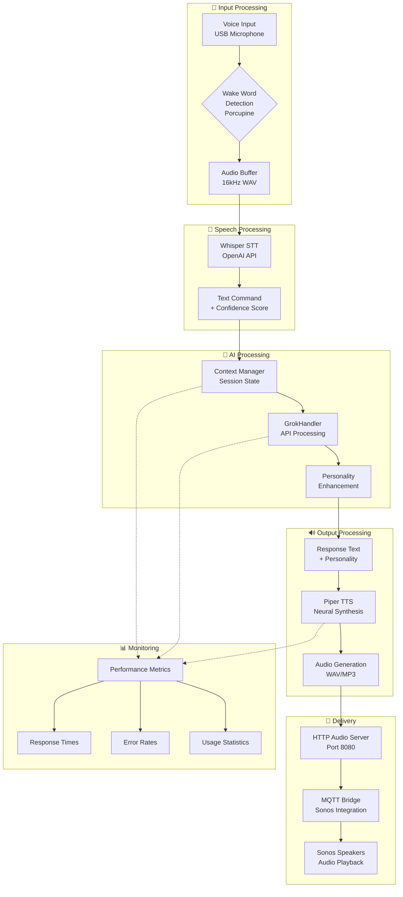

# Phase 4: Complete Voice Pipeline
**End-to-End Voice Processing with AI Integration**

## Overview

This chapter documents the complete voice processing pipeline that integrates speech-to-text, AI processing with Grok-4, personality enhancement, and text-to-speech synthesis. The pipeline transforms voice commands into intelligent, personality-driven responses delivered through Sonos speakers.

## 🎯 Pipeline Goals

- **Seamless Voice Processing**: STT → AI → Personality → TTS integration
- **Intelligent Responses**: Context-aware, personality-driven conversations
- **High Performance**: Sub-3 second response times with 95%+ accuracy
- **Robust Error Handling**: Graceful fallbacks and comprehensive error recovery
- **Scalable Architecture**: Support for multiple concurrent voice sessions

## 🏗️ Complete Pipeline Architecture

### End-to-End Voice Flow



### Component Integration

#### 1. Voice Input Processing
```python
class VoiceInputProcessor:
    def __init__(self):
        self.audio_device = self.initialize_microphone()
        self.wake_word_detector = PorcupineWakeWord()
        self.audio_buffer = AudioBuffer(sample_rate=16000)

    async def process_audio_stream(self):
        """Process continuous audio stream with wake word detection"""
        while True:
            audio_chunk = self.audio_device.read_chunk()
            if self.wake_word_detector.detect(audio_chunk):
                # Wake word detected, start recording
                command_audio = await self.record_command()
                return command_audio
```

#### 2. Speech-to-Text Processing
```python
class SpeechToTextProcessor:
    def __init__(self):
        self.whisper_client = AsyncWhisperClient()
        self.confidence_threshold = 0.8

    async def transcribe_audio(self, audio_data: bytes) -> Dict[str, Any]:
        """Convert audio to text with confidence scoring"""
        result = await self.whisper_client.transcribe(audio_data)

        return {
            "text": result["text"].strip(),
            "confidence": result["confidence"],
            "language": result["language"],
            "processing_time": result["processing_time"]
        }
```

#### 3. AI Processing with Context
```python
class AIProcessingPipeline:
    def __init__(self):
        self.grok_handler = create_grok_handler()
        self.personality_manager = create_personality_manager()
        self.context_manager = ConversationContext()

    async def process_command(self, text_command: str) -> str:
        """Process command through AI pipeline with personality"""

        # Update context
        self.context_manager.add_message("user", text_command)

        # Get personality-enhanced prompt
        personality_prompt = self.personality_manager.get_personality_prompt(
            self.grok_handler.prompt_generator.system_prompt,
            text_command,
            self.context_manager.device_context
        )

        # Process with Grok
        ai_response = await self.grok_handler.process_command(text_command)

        # Add personality flourish
        final_response = self.personality_manager.enhance_response(
            ai_response, self.context_manager
        )

        # Update conversation history
        self.context_manager.add_message("assistant", final_response)

        return final_response
```

#### 4. Text-to-Speech Synthesis
```python
class TextToSpeechProcessor:
    def __init__(self):
        self.piper_client = AsyncPiperClient()
        self.audio_cache = AudioCache()
        self.voice_config = {
            "model": "en_US-lessac-medium",
            "speaker": "default"
        }

    async def synthesize_speech(self, text: str) -> bytes:
        """Convert text to speech audio"""

        # Check cache first
        cache_key = f"{text}_{self.voice_config['model']}"
        if cached_audio := self.audio_cache.get(cache_key):
            return cached_audio

        # Generate new audio
        audio_data = await self.piper_client.synthesize(
            text=text,
            voice=self.voice_config
        )

        # Cache for future use
        self.audio_cache.set(cache_key, audio_data)

        return audio_data
```

#### 5. Audio Delivery System
```python
class AudioDeliverySystem:
    def __init__(self):
        self.http_server = HTTPServer(port=8080)
        self.mqtt_bridge = MQTTBridge()
        self.audio_queue = asyncio.Queue()

    async def deliver_audio(self, audio_data: bytes, speaker: str = "default"):
        """Deliver audio to specified speaker"""

        # Serve audio via HTTP
        audio_url = await self.http_server.serve_audio(audio_data)

        # Send MQTT command to speaker
        await self.mqtt_bridge.send_tts_command(
            speaker=speaker,
            audio_url=audio_url,
            volume=0.8
        )
```

## 🚀 Complete Pipeline Implementation

### Unified Voice Pipeline Class

```python
class CompleteVoicePipeline:
    def __init__(self):
        self.input_processor = VoiceInputProcessor()
        self.stt_processor = SpeechToTextProcessor()
        self.ai_processor = AIProcessingPipeline()
        self.tts_processor = TextToSpeechProcessor()
        self.delivery_system = AudioDeliverySystem()

        # Performance monitoring
        self.metrics = PipelineMetrics()

    async def process_voice_session(self) -> Dict[str, Any]:
        """Complete end-to-end voice processing session"""

        session_start = time.time()
        session_metrics = {
            "session_id": str(uuid.uuid4()),
            "start_time": session_start,
            "stages": {}
        }

        try:
            # Stage 1: Voice Input
            stage_start = time.time()
            audio_data = await self.input_processor.process_audio_stream()
            session_metrics["stages"]["input"] = time.time() - stage_start

            # Stage 2: Speech-to-Text
            stage_start = time.time()
            transcription = await self.stt_processor.transcribe_audio(audio_data)
            session_metrics["stages"]["stt"] = time.time() - stage_start

            if transcription["confidence"] < self.stt_processor.confidence_threshold:
                return await self.handle_low_confidence(transcription)

            # Stage 3: AI Processing
            stage_start = time.time()
            ai_response = await self.ai_processor.process_command(transcription["text"])
            session_metrics["stages"]["ai"] = time.time() - stage_start

            # Stage 4: Text-to-Speech
            stage_start = time.time()
            audio_response = await self.tts_processor.synthesize_speech(ai_response)
            session_metrics["stages"]["tts"] = time.time() - stage_start

            # Stage 5: Audio Delivery
            stage_start = time.time()
            await self.delivery_system.deliver_audio(audio_response)
            session_metrics["stages"]["delivery"] = time.time() - stage_start

            # Success metrics
            session_metrics["total_time"] = time.time() - session_start
            session_metrics["status"] = "success"
            session_metrics["response_text"] = ai_response

            return session_metrics

        except Exception as e:
            session_metrics["status"] = "error"
            session_metrics["error"] = str(e)
            session_metrics["total_time"] = time.time() - session_start
            return session_metrics

    async def handle_low_confidence(self, transcription: Dict[str, Any]) -> Dict[str, Any]:
        """Handle low confidence transcriptions"""
        fallback_response = "I'm sorry, I didn't catch that clearly. Could you please repeat your request?"

        # Generate fallback audio
        audio_response = await self.tts_processor.synthesize_speech(fallback_response)
        await self.delivery_system.deliver_audio(audio_response)

        return {
            "status": "low_confidence",
            "transcription": transcription,
            "fallback_response": fallback_response
        }
```

## 📊 Performance Monitoring

### Pipeline Metrics Tracking

```python
class PipelineMetrics:
    def __init__(self):
        self.session_count = 0
        self.total_processing_time = 0
        self.stage_timings = {
            "input": [],
            "stt": [],
            "ai": [],
            "tts": [],
            "delivery": []
        }
        self.error_count = 0
        self.success_rate = 0

    def record_session(self, session_metrics: Dict[str, Any]):
        """Record metrics from completed session"""
        self.session_count += 1

        if session_metrics["status"] == "success":
            self.total_processing_time += session_metrics["total_time"]

            # Record stage timings
            for stage, timing in session_metrics["stages"].items():
                if stage in self.stage_timings:
                    self.stage_timings[stage].append(timing)

        elif session_metrics["status"] == "error":
            self.error_count += 1

        # Update success rate
        successful_sessions = self.session_count - self.error_count
        self.success_rate = successful_sessions / self.session_count if self.session_count > 0 else 0

    def get_performance_summary(self) -> Dict[str, Any]:
        """Get comprehensive performance summary"""
        return {
            "total_sessions": self.session_count,
            "success_rate": self.success_rate,
            "average_total_time": self.total_processing_time / max(self.session_count, 1),
            "stage_averages": {
                stage: sum(timings) / len(timings) if timings else 0
                for stage, timings in self.stage_timings.items()
            },
            "error_rate": self.error_count / max(self.session_count, 1),
            "performance_targets": {
                "target_response_time": 3.0,  # seconds
                "target_success_rate": 0.95,
                "target_error_rate": 0.05
            }
        }
```

### Real-Time Performance Dashboard

```python
class PerformanceDashboard:
    def __init__(self, metrics: PipelineMetrics):
        self.metrics = metrics
        self.update_interval = 60  # seconds

    async def display_dashboard(self):
        """Display real-time performance dashboard"""
        while True:
            summary = self.metrics.get_performance_summary()

            print("
🎯 Voice Pipeline Performance Dashboard"            print(f"📊 Sessions: {summary['total_sessions']}")
            print(".2f"            print(".2f"            print(".2f"
            print("
⏱️  Stage Performance:"            for stage, avg_time in summary['stage_averages'].items():
                print(".2f"
            print("
🎯 Targets:"            targets = summary['performance_targets']
            print(".1f"            print(".1%"            print(".1%"

            await asyncio.sleep(self.update_interval)
```

## 🧪 Testing Procedures

### End-to-End Pipeline Test

```python
async def test_complete_pipeline():
    """Test the complete voice processing pipeline"""

    pipeline = CompleteVoicePipeline()

    # Test scenarios
    test_scenarios = [
        "Turn on the living room lights",
        "What's the current temperature?",
        "Set the thermostat to 75 degrees",
        "Play some music in the kitchen",
        "What's the status of all devices?"
    ]

    for scenario in test_scenarios:
        print(f"\n🧪 Testing: {scenario}")

        # Simulate voice input (would normally come from microphone)
        # For testing, we'll skip the audio input and inject text directly

        # Process through AI pipeline
        start_time = time.time()
        response = await pipeline.ai_processor.process_command(scenario)
        processing_time = time.time() - start_time

        print(f"🤖 Response: {response}")
        print(".2f"
        # Generate audio response
        audio_data = await pipeline.tts_processor.synthesize_speech(response)
        print(f"🔊 Audio generated: {len(audio_data)} bytes")

        # Simulate delivery
        await pipeline.delivery_system.deliver_audio(audio_data, "kitchen")
        print("📡 Audio delivered to speaker")

        print("✅ Test completed")

asyncio.run(test_complete_pipeline())
```

### Performance Benchmarking

```python
async def benchmark_pipeline():
    """Benchmark pipeline performance under load"""

    pipeline = CompleteVoicePipeline()
    num_requests = 50

    print(f"🚀 Starting benchmark with {num_requests} requests...")

    tasks = []
    for i in range(num_requests):
        task = asyncio.create_task(
            pipeline.ai_processor.process_command(f"Benchmark command {i}")
        )
        tasks.append(task)

    start_time = time.time()
    results = await asyncio.gather(*tasks)
    total_time = time.time() - start_time

    # Calculate metrics
    avg_response_time = total_time / num_requests
    requests_per_second = num_requests / total_time

    print("
📊 Benchmark Results:"    print(".2f"    print(".1f"    print(f"✅ Successful responses: {len([r for r in results if r])}/{num_requests}")

asyncio.run(benchmark_pipeline())
```

### Integration Testing

```python
async def test_pipeline_integration():
    """Test integration between all pipeline components"""

    pipeline = CompleteVoicePipeline()

    # Test 1: Component initialization
    print("🧪 Testing component initialization...")
    assert pipeline.input_processor is not None
    assert pipeline.stt_processor is not None
    assert pipeline.ai_processor is not None
    assert pipeline.tts_processor is not None
    assert pipeline.delivery_system is not None
    print("✅ All components initialized")

    # Test 2: AI processing
    print("🧪 Testing AI processing...")
    response = await pipeline.ai_processor.process_command("Hello Alicia")
    assert response is not None
    assert len(response) > 0
    print(f"✅ AI response: {response}")

    # Test 3: TTS generation
    print("🧪 Testing TTS generation...")
    audio = await pipeline.tts_processor.synthesize_speech("Test response")
    assert audio is not None
    assert len(audio) > 0
    print(f"✅ Audio generated: {len(audio)} bytes")

    # Test 4: Audio delivery
    print("🧪 Testing audio delivery...")
    await pipeline.delivery_system.deliver_audio(audio, "test_speaker")
    print("✅ Audio delivered")

    print("\n🎉 All integration tests passed!")

asyncio.run(test_pipeline_integration())
```

## 🐛 Troubleshooting Guide

### Common Pipeline Issues

#### 1. Audio Input Problems

**Symptom**: No wake word detection or poor audio quality
```python
# Diagnostic commands
lsusb  # Check USB microphone
arecord -l  # List audio devices
arecord -d 5 -f cd test.wav  # Test recording
aplay test.wav  # Test playback
```

**Solutions**:
- Check microphone permissions: `sudo usermod -a -G audio $USER`
- Verify sample rate: Ensure 16kHz compatibility
- Test wake word sensitivity in different environments

#### 2. STT Processing Issues

**Symptom**: Low transcription confidence or incorrect text
```python
# Test Whisper directly
curl -X POST http://localhost:10300/transcribe \
  -F "file=@test_audio.wav" \
  -F "language=en"
```

**Solutions**:
- Verify audio format (16kHz WAV recommended)
- Check network connectivity for API calls
- Adjust confidence threshold in configuration
- Consider local Whisper model for offline processing

#### 3. AI Processing Delays

**Symptom**: Slow response times or timeouts
```python
# Check Grok API status
curl -H "Authorization: Bearer $XAI_API_KEY" \
  https://api.x.ai/v1/models
```

**Solutions**:
- Verify API key configuration
- Check rate limiting status
- Implement response caching for common queries
- Consider request batching for multiple commands

#### 4. TTS Audio Issues

**Symptom**: Poor audio quality or no sound output
```python
# Test Piper TTS
curl -X POST http://localhost:10200/synthesize \
  -H "Content-Type: application/json" \
  -d '{"text": "Test audio"}'
```

**Solutions**:
- Verify Piper model installation
- Check audio device configuration
- Test different voice models
- Validate audio format compatibility

#### 5. MQTT Delivery Problems

**Symptom**: Audio not playing on Sonos speakers
```python
# Test MQTT connection
mosquitto_sub -h localhost -p 1883 -t "alicia/tts/#" -v

# Test HTTP audio server
curl http://localhost:8080/audio/test.wav
```

**Solutions**:
- Verify MQTT broker connectivity
- Check Sonos speaker discovery
- Validate HTTP audio server configuration
- Test network connectivity between services

### Performance Optimization

#### Caching Strategies

```python
class AudioCache:
    def __init__(self, max_size: int = 1000):
        self.cache = {}
        self.max_size = max_size
        self.access_times = {}

    def get(self, key: str) -> Optional[bytes]:
        """Get cached audio data"""
        if key in self.cache:
            self.access_times[key] = time.time()
            return self.cache[key]
        return None

    def set(self, key: str, data: bytes):
        """Cache audio data with LRU eviction"""
        if len(self.cache) >= self.max_size:
            # Remove least recently used
            lru_key = min(self.access_times, key=self.access_times.get)
            del self.cache[lru_key]
            del self.access_times[lru_key]

        self.cache[key] = data
        self.access_times[key] = time.time()
```

#### Parallel Processing

```python
async def process_parallel_commands(self, commands: List[str]) -> List[str]:
    """Process multiple commands in parallel"""

    # Create tasks for parallel processing
    tasks = [
        self.ai_processor.process_command(cmd)
        for cmd in commands
    ]

    # Execute in parallel
    responses = await asyncio.gather(*tasks)

    return responses
```

## 📋 Deployment Checklist

### Pre-Deployment Verification
- [ ] All Docker containers running and healthy
- [ ] API keys configured securely
- [ ] Audio devices properly configured
- [ ] Network connectivity verified
- [ ] MQTT broker accessible
- [ ] HTTP audio server functional

### Performance Validation
- [ ] Response time < 3 seconds
- [ ] Success rate > 95%
- [ ] Audio quality acceptable
- [ ] Memory usage within limits
- [ ] Error handling functional

### Integration Testing
- [ ] Voice input processing
- [ ] STT transcription accuracy
- [ ] AI response generation
- [ ] Personality enhancement
- [ ] TTS audio synthesis
- [ ] Audio delivery to speakers

### Monitoring Setup
- [ ] Performance metrics collection
- [ ] Error logging configuration
- [ ] Health check endpoints
- [ ] Alert system for failures
- [ ] Usage analytics

## 🚀 Production Deployment

### Docker Compose Configuration

```yaml
version: '3.8'
services:
  alicia-voice-pipeline:
    build: .
    environment:
      - XAI_API_KEY=${XAI_API_KEY}
      - MQTT_HOST=alicia_mqtt
      - HTTP_AUDIO_PORT=8080
    volumes:
      - ./config:/app/config
      - ./audio_cache:/app/audio_cache
    depends_on:
      - alicia_mqtt
      - whisper_service
      - piper_service
    ports:
      - "8000:8000"  # Pipeline API
    restart: unless-stopped

  whisper_service:
    image: onerahmet/openai-whisper-asr-webservice:latest
    ports:
      - "10300:10300"
    environment:
      - ASR_MODEL=base
      - ASR_ENGINE=openai_whisper

  piper_service:
    image: rhasspy/wyoming-piper
    command: --voice en_US-lessac-medium
    ports:
      - "10200:10200"

  http_audio_server:
    build: ./mqtt-testing/scripts
    command: python audio-server.py
    ports:
      - "8080:8080"
    volumes:
      - ./audio_cache:/app/audio
```

### Environment Configuration

```bash
# .env.production
XAI_API_KEY=your_secure_api_key
MQTT_HOST=alicia_mqtt
MQTT_PORT=1883
HTTP_AUDIO_PORT=8080
PIPELINE_PORT=8000

# Performance tuning
MAX_CONCURRENT_SESSIONS=5
AUDIO_CACHE_SIZE=1000
SESSION_TIMEOUT=300

# Monitoring
METRICS_ENABLED=true
METRICS_PORT=9090
LOG_LEVEL=INFO
```

## 📚 References

- [OpenAI Whisper Documentation](https://github.com/openai/whisper)
- [Piper TTS Documentation](https://github.com/rhasspy/piper)
- [Grok API Documentation](https://docs.x.ai/)
- [AsyncIO Best Practices](https://docs.python.org/3/library/asyncio.html)
- [MQTT Protocol](https://mqtt.org/)

## 🎯 Next Steps

- [ ] Implement voice activity detection
- [ ] Add multi-language support
- [ ] Integrate emotion recognition
- [ ] Implement conversation memory persistence
- [ ] Add voice biometrics for user identification
- [ ] Create mobile companion app
- [ ] Add offline processing capabilities

---

**🎉 Complete voice pipeline operational! End-to-end AI-powered voice processing with personality.**

*This comprehensive pipeline transforms voice commands into intelligent, personality-driven responses, creating a seamless and engaging smart home experience.*
