# 🏠 Alicia System MOC (Map of Content)

> **MOC**: Map of Content - Your central hub for understanding the entire Alicia ecosystem

## 🎯 **What is Alicia?**

Alicia is a **production-ready smart home AI assistant** built on a sophisticated **23-service microservices architecture**. Think of her as your personal AI butler who lives in your walls, ready to help you control your entire home with just your voice.

## 🧠 **Knowledge Graph Overview**

```mermaid
graph TD
    A[Alicia System] --> B[Voice Pipeline]
    A --> C[Device Integration]
    A --> D[AI Intelligence]
    A --> E[Security & Monitoring]
    A --> F[User Interface]
    
    B --> B1[STT Service]
    B --> B2[AI Service]
    B --> B3[TTS Service]
    B --> B4[Voice Router]
    
    C --> C1[Device Manager]
    C --> C2[HA Bridge]
    C --> C3[Sonos Integration]
    C --> C4[Device Registry]
    
    D --> D1[Personality System]
    D --> D2[Multi-Language]
    D --> D3[Grok Integration]
    D --> D4[Advanced Voice]
    
    E --> E1[Security Gateway]
    E --> E2[Health Monitor]
    E --> E3[Load Balancer]
    E --> E4[Metrics Collector]
    
    F --> F1[Config Manager]
    F --> F2[Monitor Dashboard]
    F --> F3[Real-time Updates]
    F --> F4[Mobile Interface]
```



## 🎯 **Core Concepts**

### **🏗️ Architecture Foundation**
- **[[Message Bus Architecture]]** - MQTT-based communication system
- **[[Microservices Design]]** - 23 independent, containerized services
- **[[Service Communication]]** - How services talk to each other
- **[[Security Architecture]]** - Enterprise-grade security and encryption

### **🎤 Voice Processing**
- **[[Voice Pipeline]]** - Complete voice processing workflow
- **[[STT Service]]** - Speech-to-text with multiple engines
- **[[AI Service]]** - Natural language processing and understanding
- **[[TTS Service]]** - Text-to-speech with high-quality voices
- **[[Voice Router]]** - Orchestrates the entire voice pipeline

### **🏠 Smart Home Integration**
- **[[Device Management]]** - Universal device control system
- **[[Home Assistant Bridge]]** - Seamless HA integration
- **[[Sonos Integration]]** - Multi-room audio control
- **[[Device Registry]]** - Centralized device management

### **🤖 AI Intelligence**
- **[[Personality System]]** - Dynamic AI personalities
- **[[Multi-Language Support]]** - 9 languages with real-time translation
- **[[Grok Integration]]** - Advanced AI conversation management
- **[[Advanced Voice]]** - Emotion detection and voice analysis

## 🎮 **User Experience**

### **🎯 Getting Started**
- **[[Quick Start Guide]]** - Get running in 15 minutes
- **[[First Voice Command]]** - Say hello to Alicia
- **[[Connecting Devices]]** - Bring your smart home to life
- **[[Setting Up Rooms]]** - Organize your smart home

### **🎤 Voice Commands**
- **[[Voice Commands 101]]** - Master voice control
- **[[Custom Commands]]** - Create your own shortcuts
- **[[Room-Specific Commands]]** - Control different spaces
- **[[Scene Commands]]** - Set perfect moods

### **🎨 Customization**
- **[[Personalities & Moods]]** - Choose your AI assistant
- **[[Multi-Language Magic]]** - Speak your language
- **[[Automation & Schedules]]** - Set it and forget it
- **[[Themes & Appearance]]** - Make it yours

## 🔧 **Technical Deep Dive**

### **🏗️ Core Infrastructure**
- **[[MQTT Broker]]** - Eclipse Mosquitto 2.0.18+ configuration
- **[[Security Gateway]]** - Authentication and authorization
- **[[Device Registry]]** - Device discovery and management
- **[[Health Monitor]]** - System health and performance monitoring
- **[[Configuration Service]]** - Centralized configuration management

### **🎤 Voice Services**
- **[[STT Service Implementation]]** - Whisper integration and optimization
- **[[AI Service & Grok Integration]]** - xAI Grok API integration
- **[[TTS Service & Voice Router]]** - Piper TTS implementation
- **[[Advanced Voice Processing]]** - Emotion detection and VAD

### **🏠 Device Services**
- **[[Device Manager & Control]]** - Device abstraction layer
- **[[Home Assistant Bridge]]** - HA integration patterns
- **[[Sonos Integration]]** - Multi-room audio control
- **[[Device Control Services]]** - Generic device control

### **🤖 Advanced Features**
- **[[Personality System]]** - Character profile management
- **[[Multi-Language Support]]** - Internationalization architecture
- **[[Advanced Voice Processing]]** - Audio enhancement and analysis
- **[[Grok Integration]]** - Enhanced AI conversation management

### **📊 Supporting Services**
- **[[Load Balancer & Metrics]]** - Load balancing algorithms
- **[[Metrics Collector]]** - Performance metrics collection
- **[[Event Scheduler]]** - Cron-like scheduling
- **[[Service Orchestrator]]** - Service lifecycle management

## 🎨 **Visual Learning**

### **📊 System Diagrams**
- **[[Architecture Overview]]** - High-level system design
- **[[Service Communication]]** - How services interact
- **[[Data Flow]]** - Information flow through the system
- **[[Deployment Architecture]]** - Production deployment structure

### **🎨 Concept Drawings**
- **[[Voice Pipeline Flow]]** - Visual voice processing
- **[[Device Integration]]** - Smart home device connections
- **[[AI Personality System]]** - Personality and mood concepts
- **[[User Interface Design]]** - Web interface layouts

### **📈 Process Flows**
- **[[Voice Command Flow]]** - From speech to action
- **[[Device Control Flow]]** - Command execution process
- **[[Error Handling Flow]]** - Problem resolution process
- **[[Learning Flow]]** - How Alicia learns and adapts

## 🔍 **Quick Reference**

### **🚀 Getting Started**
- **[[Installation Guide]]** - Set up Alicia
- **[[Configuration]]** - Configure your system
- **[[First Steps]]** - Your first voice commands
- **[[Troubleshooting]]** - Fix common issues

### **🎤 Voice Commands**
- **[[Basic Commands]]** - Essential voice commands
- **[[Advanced Commands]]** - Complex voice interactions
- **[[Custom Commands]]** - Create your own
- **[[Command Reference]]** - Complete command list

### **🏠 Device Control**
- **[[Supported Devices]]** - Compatible smart devices
- **[[Device Setup]]** - Connect your devices
- **[[Room Organization]]** - Organize by rooms
- **[[Scene Creation]]** - Create custom scenes

### **🔧 Technical Reference**
- **[[API Documentation]]** - Service APIs
- **[[Configuration Options]]** - All settings
- **[[Performance Tuning]]** - Optimize your system
- **[[Security Guide]]** - Security best practices

## 📊 **Dynamic Content**

### **📋 Service Status**
```dataview
TABLE status, uptime, last_seen
FROM "services"
WHERE status != null
SORT uptime DESC
```

### **📊 Performance Metrics**
```dataview
TABLE cpu_usage, memory_usage, response_time
FROM "metrics"
WHERE timestamp > date(today) - dur(1 day)
SORT timestamp DESC
```

### **🎯 Quick Actions**
- **[[Start Alicia]]** - Launch the system
- **[[Stop Alicia]]** - Shutdown the system
- **[[Restart Services]]** - Restart all services
- **[[Check Status]]** - View system status

## 🎯 **Learning Paths**

### **🏠 For Smart Home Enthusiasts**
1. **Start**: [[Quick Start Guide]]
2. **Learn**: [[Voice Commands 101]]
3. **Explore**: [[Connecting Devices]]
4. **Master**: [[Setting Up Rooms]]

### **🔧 For Developers**
1. **Start**: [[Architecture Overview]]
2. **Learn**: [[Service Communication]]
3. **Explore**: [[Voice Pipeline]]
4. **Master**: [[Technical Deep Dive]]

### **🎨 For Visual Learners**
1. **Start**: [[System Diagrams]]
2. **Learn**: [[Concept Drawings]]
3. **Explore**: [[Process Flows]]
4. **Master**: [[Visual Learning]]

## 🚀 **Advanced Features**

### **🧠 Knowledge Graph**
- **[[Graph Analysis]]** - Understand connections
- **[[Backlink Exploration]]** - Discover related concepts
- **[[Tag Navigation]]** - Find content by topic
- **[[Search Strategies]]** - Effective searching techniques

### **📊 Data Visualization**
- **[[Service Monitoring]]** - Real-time system status
- **[[Performance Tracking]]** - System performance metrics
- **[[Usage Analytics]]** - How you use Alicia
- **[[Custom Dashboards]]** - Personal information displays

### **🎯 Personalization**
- **[[Custom Tags]]** - Organize your knowledge
- **[[Personal Notes]]** - Add your own insights
- **[[Bookmark System]]** - Save important concepts
- **[[Learning Progress]]** - Track your understanding

## 🎉 **What Makes This Special**

### **🧠 Interconnected Knowledge**
- **Bidirectional links** between all concepts
- **Visual graph** showing relationships
- **Serendipitous discovery** of new connections
- **Personal learning** that adapts to your interests

### **🎨 Visual Learning**
- **Diagrams and drawings** for complex concepts
- **Flow charts** for processes
- **Mind maps** for brainstorming
- **Interactive elements** for engagement

### **📊 Dynamic Content**
- **Live data** that updates automatically
- **Custom queries** for specific information
- **Performance tracking** and monitoring
- **Quick reference** for fast access

## 🎯 **Next Steps**

1. **Explore the links** above to dive deeper
2. **Use the graph view** to see connections
3. **Follow a learning path** that interests you
4. **Create your own notes** and annotations
5. **Share insights** with the community

---

**Welcome to your Alicia knowledge universe! 🚀**

*This MOC is your central hub for understanding and exploring the entire Alicia ecosystem. Use it to navigate, learn, and discover the fascinating world of smart home AI.*
