# 🏗️ Architecture MOC (Map of Content)

> **MOC**: Map of Content - Your complete guide to Alicia's system architecture

## 🎯 **What is Alicia's Architecture?**

Alicia is built on a **sophisticated microservices architecture** with 23 independent services communicating through an MQTT message bus. Think of it as a modern city with different districts (services) that all work together to create something amazing.

## 🧠 **Architecture Knowledge Graph**

```mermaid
graph TD
    A[Alicia Architecture] --> B[Message Bus]
    A --> C[Core Services]
    A --> D[Voice Services]
    A --> E[Device Services]
    A --> F[AI Services]
    A --> G[Supporting Services]
    A --> H[Frontend Services]
    
    B --> B1[MQTT Broker]
    B --> B2[Security Gateway]
    B --> B3[Service Discovery]
    B --> B4[Health Monitoring]
    
    C --> C1[Configuration Service]
    C --> C2[Device Registry]
    C --> C3[Load Balancer]
    C --> C4[Metrics Collector]
    
    D --> D1[STT Service]
    D --> D2[AI Service]
    D --> D3[TTS Service]
    D --> D4[Voice Router]
    
    E --> E1[Device Manager]
    E --> E2[HA Bridge]
    E --> E3[Sonos Service]
    E --> E4[Device Control]
    
    F --> F1[Personality System]
    F --> F2[Multi-Language]
    F --> F3[Grok Integration]
    F --> F4[Advanced Voice]
    
    G --> G1[Event Scheduler]
    G --> G2[Service Orchestrator]
    G --> G3[Health Monitor]
    G --> G4[Load Balancer]
    
    H --> H1[Config Manager]
    H --> H2[Monitor Dashboard]
    H --> H3[Real-time Updates]
    H --> H4[Mobile Interface]
```



## 🎯 **Core Architecture Principles**

### **🏗️ Microservices Design**
- **[[Microservices Architecture]]** - 23 independent, containerized services
- **[[Service Independence]]** - Each service can be developed, deployed, and scaled independently
- **[[Loose Coupling]]** - Services communicate through well-defined interfaces
- **[[High Cohesion]]** - Each service has a single, well-defined responsibility

### **📡 Message Bus Communication**
- **[[MQTT Message Bus]]** - Centralized communication system
- **[[Service Communication]]** - How services talk to each other
- **[[Message Routing]]** - Intelligent message routing and delivery
- **[[Event-Driven Architecture]]** - Event-based communication patterns

### **🔒 Security Architecture**
- **[[Security Gateway]]** - Centralized authentication and authorization
- **[[TLS Encryption]]** - End-to-end encrypted communication
- **[[JWT Authentication]]** - Token-based service authentication
- **[[ACL Authorization]]** - Fine-grained access control

### **📊 Monitoring & Observability**
- **[[Health Monitoring]]** - Comprehensive system health monitoring
- **[[Metrics Collection]]** - Performance metrics and analytics
- **[[Logging System]]** - Centralized logging and debugging
- **[[Alerting System]]** - Proactive issue detection and notification

## 🎮 **Service Categories**

### **🏗️ Core Infrastructure**
- **[[MQTT Broker]]** - Eclipse Mosquitto 2.0.18+ message broker
- **[[Security Gateway]]** - Authentication and authorization service
- **[[Device Registry]]** - Centralized device management
- **[[Health Monitor]]** - System health and performance monitoring
- **[[Configuration Service]]** - Centralized configuration management
- **[[Discovery Service]]** - Service discovery and registration

### **🎤 Voice Processing Services**
- **[[STT Service]]** - Speech-to-text processing
- **[[AI Service]]** - Natural language processing and understanding
- **[[TTS Service]]** - Text-to-speech synthesis
- **[[Voice Router]]** - Voice pipeline orchestration
- **[[Advanced Voice]]** - Emotion detection and voice analysis

### **🏠 Device Integration Services**
- **[[Device Manager]]** - Universal device control
- **[[HA Bridge]]** - Home Assistant integration
- **[[Sonos Service]]** - Multi-room audio control
- **[[Device Control]]** - Generic device command execution
- **[[Device Registry]]** - Device discovery and capabilities

### **🤖 AI & Intelligence Services**
- **[[Personality System]]** - AI personality and character management
- **[[Multi-Language]]** - Internationalization and translation
- **[[Grok Integration]]** - Advanced AI conversation management
- **[[Advanced Voice]]** - Voice processing enhancements

### **📊 Supporting Services**
- **[[Load Balancer]]** - Traffic distribution and load management
- **[[Metrics Collector]]** - Performance metrics and analytics
- **[[Event Scheduler]]** - Task scheduling and automation
- **[[Service Orchestrator]]** - Service lifecycle management

### **🎨 Frontend Services**
- **[[Config Manager]]** - Web-based configuration interface
- **[[Monitor Dashboard]]** - Real-time system monitoring
- **[[Real-time Communication]]** - WebSocket-based updates
- **[[Mobile Interface]]** - Mobile-optimized interfaces

## 🎨 **Visual Learning**

### **📊 Architecture Diagrams**
- **[[System Overview Diagram]]** - High-level system architecture
- **[[Service Communication Diagram]]** - How services interact
- **[[Data Flow Diagram]]** - Information flow through the system
- **[[Deployment Architecture]]** - Production deployment structure

### **🎨 Concept Drawings**
- **[[Microservices Concept]]** - Visual microservices architecture
- **[[Message Bus Concept]]** - MQTT communication visualization
- **[[Service Integration Concept]]** - Service integration patterns
- **[[Security Architecture Concept]]** - Security system visualization

### **📈 Process Flows**
- **[[Service Startup Flow]]** - How services start and initialize
- **[[Message Processing Flow]]** - How messages are processed
- **[[Error Handling Flow]]** - System error handling and recovery
- **[[Scaling Flow]]** - How the system scales with load

## 🔍 **Quick Reference**

### **🏗️ Architecture Patterns**
- **[[Microservices Patterns]]** - Common microservices patterns
- **[[Message Bus Patterns]]** - MQTT communication patterns
- **[[Service Discovery Patterns]]** - Service discovery mechanisms
- **[[Load Balancing Patterns]]** - Load balancing strategies

### **🔧 Technical Reference**
- **[[Service APIs]]** - All service API documentation
- **[[Configuration Options]]** - System configuration settings
- **[[Performance Tuning]]** - Architecture optimization
- **[[Security Guidelines]]** - Security best practices

### **📊 Monitoring & Debugging**
- **[[Health Checks]]** - Service health monitoring
- **[[Performance Metrics]]** - System performance tracking
- **[[Logging Guidelines]]** - Logging and debugging
- **[[Troubleshooting Guide]]** - Common issues and solutions

## 📊 **Dynamic Content**

### **📋 Service Status**
```dataview
TABLE status, uptime, cpu_usage, memory_usage
FROM "services"
WHERE status != null
SORT uptime DESC
```

### **📊 Performance Metrics**
```dataview
TABLE response_time, throughput, error_rate
FROM "performance-metrics"
WHERE timestamp > date(today) - dur(1 day)
SORT response_time ASC
```

### **🔍 Service Dependencies**
```dataview
TABLE dependencies, health_status, last_updated
FROM "service-dependencies"
WHERE dependencies != null
SORT health_status ASC
```

## 🎯 **Learning Paths**

### **🏗️ For Architects**
1. **Start**: [[System Overview Diagram]]
2. **Learn**: [[Microservices Architecture]]
3. **Explore**: [[Service Communication]]
4. **Master**: [[Architecture Patterns]]

### **🔧 For Developers**
1. **Start**: [[Service APIs]]
2. **Learn**: [[Service Implementation]]
3. **Explore**: [[Integration Patterns]]
4. **Master**: [[Technical Deep Dive]]

### **🎨 For Visual Learners**
1. **Start**: [[Architecture Diagrams]]
2. **Learn**: [[Concept Drawings]]
3. **Explore**: [[Process Flows]]
4. **Master**: [[Visual Learning]]

## 🚀 **Advanced Architecture Topics**

### **🏗️ Scalability & Performance**
- **[[Horizontal Scaling]]** - Scaling services horizontally
- **[[Load Balancing]]** - Distributing load across services
- **[[Caching Strategies]]** - Implementing effective caching
- **[[Performance Optimization]]** - Optimizing system performance
- **[[Resource Management]]** - Managing system resources

### **🔒 Security & Compliance**
- **[[Security Architecture]]** - Comprehensive security design
- **[[Authentication Systems]]** - User and service authentication
- **[[Authorization Models]]** - Access control and permissions
- **[[Data Protection]]** - Data security and privacy
- **[[Compliance Standards]]** - Meeting regulatory requirements

### **📊 Monitoring & Observability**
- **[[Health Monitoring]]** - System health and status monitoring
- **[[Performance Monitoring]]** - Performance metrics and tracking
- **[[Logging Systems]]** - Centralized logging and analysis
- **[[Alerting Systems]]** - Proactive issue detection
- **[[Debugging Tools]]** - Tools for troubleshooting and debugging

### **🔄 DevOps & Deployment**
- **[[Containerization]]** - Docker containerization strategy
- **[[Orchestration]]** - Service orchestration and management
- **[[CI/CD Pipeline]]** - Continuous integration and deployment
- **[[Environment Management]]** - Managing different environments
- **[[Rollback Strategies]]** - Safe deployment rollback procedures

## 🎯 **Architecture Decision Records (ADRs)**

### **🏗️ Design Decisions**
- **[[ADR-001: Microservices Architecture]]** - Why we chose microservices
- **[[ADR-002: MQTT Message Bus]]** - Why MQTT for service communication
- **[[ADR-003: Docker Containerization]]** - Why Docker for deployment
- **[[ADR-004: Security Gateway]]** - Centralized security approach
- **[[ADR-005: Service Discovery]]** - Service discovery mechanism

### **🔧 Technical Decisions**
- **[[ADR-006: Python for Services]]** - Why Python for most services
- **[[ADR-007: FastAPI Framework]]** - Why FastAPI for service APIs
- **[[ADR-008: SQLite Database]]** - Database choice for services
- **[[ADR-009: React Frontend]]** - Frontend technology choice
- **[[ADR-010: WebSocket Communication]]** - Real-time communication choice

## 🎉 **What Makes This Architecture Special**

### **🧠 Intelligent Design**
- **Microservices architecture** for scalability and maintainability
- **Message bus communication** for loose coupling
- **Event-driven patterns** for responsiveness
- **Service discovery** for dynamic service management

### **🔒 Security First**
- **TLS encryption** for all communications
- **JWT authentication** for secure service access
- **ACL authorization** for fine-grained control
- **Security gateway** for centralized security

### **📊 Observability**
- **Comprehensive monitoring** of all services
- **Performance metrics** for optimization
- **Health checks** for reliability
- **Centralized logging** for debugging

### **🚀 Scalability**
- **Horizontal scaling** of individual services
- **Load balancing** for traffic distribution
- **Resource management** for optimal performance
- **Auto-scaling** based on demand

## 🎯 **Next Steps**

1. **Explore the links** above to dive deeper
2. **Use the graph view** to see connections
3. **Follow a learning path** that interests you
4. **Create your own notes** and annotations
5. **Share insights** with the community

---

**Welcome to the architecture universe! 🏗️**

*This MOC is your complete guide to understanding and mastering Alicia's system architecture. Use it to explore, learn, and discover the fascinating world of microservices architecture.*
