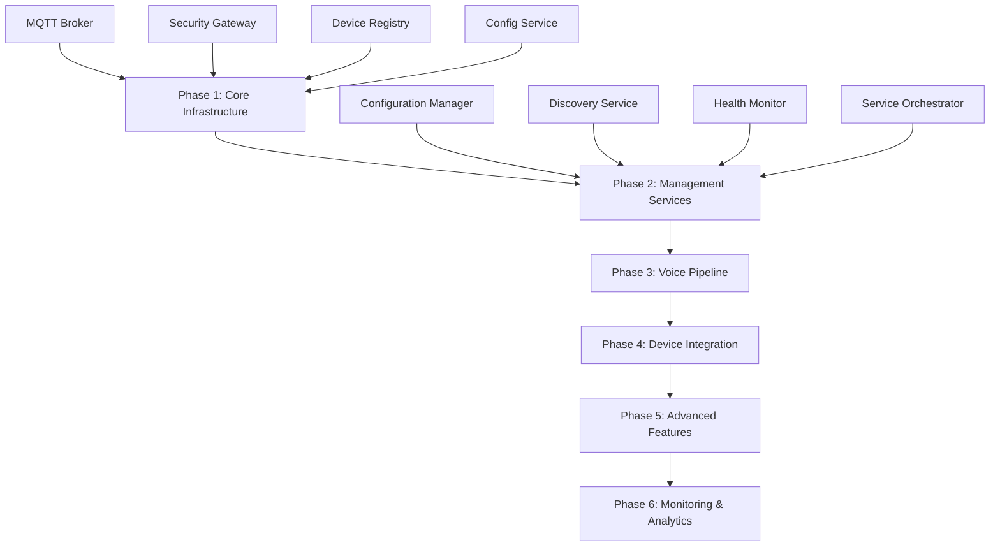

# 🚀 Deployment Pipeline MOC

**Map of Content for Alicia Service Deployment and Orchestration**

## 🎯 **Overview**

This MOC provides a comprehensive guide to deploying, managing, and maintaining the Alicia microservices architecture. It covers everything from initial setup to production deployment, including troubleshooting, monitoring, and scaling procedures.

## 🏗️ **Deployment Architecture**

### **Deployment Phases**



### **Service Deployment Order**

#### **Phase 1: Core Infrastructure (Foundation)**
1. **MQTT Broker** - Message bus foundation
2. **Security Gateway** - Authentication and authorization
3. **Device Registry** - Service registration and discovery
4. **Config Service** - Configuration management

#### **Phase 2: Management Services (Orchestration)**
5. **Configuration Manager** - Configuration distribution
6. **Discovery Service** - Service discovery and topology
7. **Health Monitor** - Health monitoring and alerting
8. **Service Orchestrator** - Service lifecycle management

#### **Phase 3: Voice Pipeline (AI Processing)**
9. **STT Service** - Speech-to-text processing
10. **AI Service** - Natural language processing
11. **TTS Service** - Text-to-speech synthesis
12. **Voice Router** - Voice pipeline orchestration

#### **Phase 4: Device Integration (Smart Home)**
13. **Device Manager** - Device abstraction and management
14. **HA Bridge** - Home Assistant integration
15. **Sonos Service** - Multi-room audio control
16. **Device Control** - Device command execution
17. **Grok Integration** - xAI Grok API integration

#### **Phase 5: Advanced Features (Enhancement)**
18. **Advanced Voice** - Enhanced voice processing
19. **Personality System** - Character and response management
20. **Multi-Language** - Internationalization support
21. **Load Balancer** - Traffic distribution and load balancing

#### **Phase 6: Monitoring & Analytics (Observability)**
22. **Metrics Collector** - Performance metrics collection
23. **Event Scheduler** - Scheduled task execution

## 🐳 **Docker Deployment Guide**

### **Prerequisites**
- **Docker**: Version 20.10+
- **Docker Compose**: Version 2.0+
- **Git**: For cloning the repository
- **curl**: For health checks

### **Quick Start Deployment**

#### **1. Clone Repository**
```bash
git clone https://github.com/your-org/alicia.git
cd alicia
```

#### **2. Create Docker Network**
```bash
docker network create alicia_network
```

#### **3. Start MQTT Broker**
```bash
docker run -d \
  --name alicia_mqtt_broker \
  --network alicia_network \
  -p 1884:1883 \
  eclipse-mosquitto:2.0.18
```

#### **4. Deploy All Services**
```bash
# Use the comprehensive restart script
./scripts/restart_all_services_comprehensive.bat
```

### **Manual Service Deployment**

#### **Core Infrastructure Services**
```bash
# Security Gateway
docker run -d --name alicia_security_gateway \
  --network alicia_network -p 8009:8009 \
  alicia-security-gateway

# Device Registry
docker run -d --name alicia_device_registry \
  --network alicia_network -p 8010:8010 \
  alicia-device-registry

# Config Service
docker run -d --name alicia_config_service \
  --network alicia_network -p 8026:8026 \
  alicia-config-service
```

#### **Voice Pipeline Services**
```bash
# STT Service
docker run -d --name alicia_stt_service \
  --network alicia_network -p 8001:8001 \
  alicia-stt-service

# AI Service
docker run -d --name alicia_ai_service \
  --network alicia_network -p 8002:8002 \
  alicia-ai-service

# TTS Service
docker run -d --name alicia_tts_service \
  --network alicia_network -p 8003:8003 \
  alicia-tts-service

# Voice Router
docker run -d --name alicia_voice_router \
  --network alicia_network -p 8004:8004 \
  alicia-voice-router
```

## 🔧 **Service Configuration**

### **Environment Variables**

#### **Core Configuration**
```bash
# MQTT Configuration
MQTT_BROKER=alicia_bus_core
MQTT_PORT=1883
MQTT_USERNAME=service_name
MQTT_PASSWORD=alicia_service_2024

# Service Configuration
SERVICE_NAME=service_name
SERVICE_VERSION=1.0.0
ENVIRONMENT=production
```

#### **Service-Specific Configuration**
```bash
# Security Gateway
SECURITY_GATEWAY_PORT=8009
JWT_SECRET=your_jwt_secret
CERT_PATH=/app/certs

# Device Registry
REGISTRY_DATA_PATH=/app/data
DB_PATH=/app/data/devices.db

# Config Service
CONFIG_DATA_PATH=/app/data
CONFIG_CACHE_TTL=300
```

### **Docker Compose Configuration**

#### **docker-compose.yml**
```yaml
version: '3.8'

services:
  mqtt_broker:
    image: eclipse-mosquitto:2.0.18
    container_name: alicia_mqtt_broker
    ports:
      - "1884:1883"
    networks:
      - alicia_network

  security_gateway:
    build: ./services/bus-services/security-gateway
    container_name: alicia_security_gateway
    ports:
      - "8009:8009"
    environment:
      - MQTT_BROKER=alicia_mqtt_broker
      - MQTT_PORT=1883
    networks:
      - alicia_network
    depends_on:
      - mqtt_broker

  # ... other services
```

## 📊 **Health Monitoring and Validation**

### **Health Check Endpoints**

All services expose health check endpoints:

```bash
# Core Infrastructure
curl http://localhost:8009/health  # Security Gateway
curl http://localhost:8010/health  # Device Registry
curl http://localhost:8026/health  # Config Service

# Voice Pipeline
curl http://localhost:8001/health  # STT Service
curl http://localhost:8002/health  # AI Service
curl http://localhost:8003/health  # TTS Service
curl http://localhost:8004/health  # Voice Router

# Device Integration
curl http://localhost:8016/health  # HA Bridge
curl http://localhost:8017/health  # Sonos Service
curl http://localhost:8018/health  # Device Control
curl http://localhost:8019/health  # Grok Integration
```

### **Comprehensive Health Check Script**

```bash
#!/bin/bash
# health_check.sh

services=(
  "8009:Security Gateway"
  "8010:Device Registry"
  "8015:Configuration Manager"
  "8026:Config Service"
  "8012:Discovery Service"
  "8013:Health Monitor"
  "8014:Service Orchestrator"
  "8001:STT Service"
  "8002:AI Service"
  "8003:TTS Service"
  "8004:Voice Router"
  "8006:Device Manager"
  "8016:HA Bridge"
  "8017:Sonos Service"
  "8018:Device Control"
  "8019:Grok Integration"
  "8020:Advanced Voice"
  "8021:Personality System"
  "8022:Multi-Language"
  "8023:Load Balancer"
  "8024:Metrics Collector"
  "8025:Event Scheduler"
)

echo "🔍 Checking Alicia Service Health..."
echo "=================================="

for service in "${services[@]}"; do
  port=$(echo $service | cut -d: -f1)
  name=$(echo $service | cut -d: -f2)
  
  if curl -s -f http://localhost:$port/health > /dev/null; then
    echo "✅ $name (Port $port) - Healthy"
  else
    echo "❌ $name (Port $port) - Unhealthy"
  fi
done
```

## 🚨 **Troubleshooting Guide**

### **Common Deployment Issues**

#### **1. Service Startup Failures**
```bash
# Check service logs
docker logs alicia_service_name

# Check service status
docker ps --filter "name=alicia"

# Restart specific service
docker restart alicia_service_name
```

#### **2. Network Connectivity Issues**
```bash
# Check network connectivity
docker network ls
docker network inspect alicia_network

# Test MQTT connectivity
docker exec alicia_mqtt_broker mosquitto_pub -h localhost -t "test" -m "hello"
```

#### **3. Port Conflicts**
```bash
# Check port usage
netstat -tulpn | grep :8009

# Kill process using port
sudo kill -9 $(lsof -t -i:8009)
```

#### **4. Resource Constraints**
```bash
# Check system resources
docker stats

# Check disk space
df -h

# Check memory usage
free -h
```

### **Service Recovery Procedures**

#### **1. Single Service Recovery**
```bash
# Stop service
docker stop alicia_service_name

# Remove container
docker rm alicia_service_name

# Rebuild and restart
docker build -t alicia-service-name ./services/bus-services/service-name
docker run -d --name alicia_service_name \
  --network alicia_network -p PORT:PORT \
  alicia-service-name
```

#### **2. Multiple Service Recovery**
```bash
# Stop all services
docker stop $(docker ps -q --filter "name=alicia")

# Remove all containers
docker rm $(docker ps -aq --filter "name=alicia")

# Restart in dependency order
./scripts/restart_all_services_comprehensive.bat
```

#### **3. Complete System Recovery**
```bash
# Stop all containers
docker stop $(docker ps -q)

# Remove all containers
docker rm $(docker ps -aq)

# Remove network
docker network rm alicia_network

# Recreate network
docker network create alicia_network

# Restart everything
./scripts/restart_all_services_comprehensive.bat
```

## 📈 **Performance Optimization**

### **Resource Allocation**

#### **CPU and Memory Limits**
```bash
# Run service with resource limits
docker run -d \
  --name alicia_service_name \
  --cpus="1.0" \
  --memory="512m" \
  --network alicia_network \
  -p PORT:PORT \
  alicia-service-name
```

#### **Docker Compose with Limits**
```yaml
services:
  service_name:
    build: ./services/bus-services/service-name
    container_name: alicia_service_name
    deploy:
      resources:
        limits:
          cpus: '1.0'
          memory: 512M
        reservations:
          cpus: '0.5'
          memory: 256M
```

### **Scaling Services**

#### **Horizontal Scaling**
```bash
# Scale service to multiple instances
docker run -d --name alicia_service_name_1 \
  --network alicia_network -p 8001:8001 \
  alicia-service-name

docker run -d --name alicia_service_name_2 \
  --network alicia_network -p 8002:8001 \
  alicia-service-name
```

#### **Load Balancing**
```bash
# Use load balancer for traffic distribution
docker run -d --name alicia_load_balancer \
  --network alicia_network -p 8023:8023 \
  alicia-load-balancer
```

## 🔒 **Security Considerations**

### **Network Security**
```bash
# Create isolated network
docker network create \
  --driver bridge \
  --subnet=172.20.0.0/16 \
  --ip-range=172.20.240.0/20 \
  alicia_network
```

### **Container Security**
```bash
# Run with non-root user
docker run -d \
  --user 1000:1000 \
  --name alicia_service_name \
  alicia-service-name
```

### **Secrets Management**
```bash
# Use Docker secrets
echo "your_secret" | docker secret create jwt_secret -
```

## 📊 **Monitoring and Logging**

### **Service Logs**
```bash
# View service logs
docker logs -f alicia_service_name

# View logs with timestamps
docker logs -f --timestamps alicia_service_name

# View last 100 lines
docker logs --tail 100 alicia_service_name
```

### **System Monitoring**
```bash
# Monitor resource usage
docker stats

# Monitor container health
docker ps --format "table {{.Names}}\t{{.Status}}\t{{.Ports}}"
```

### **Log Aggregation**
```bash
# Use centralized logging
docker run -d \
  --name alicia_log_aggregator \
  --network alicia_network \
  -v /var/log/alicia:/logs \
  alicia-log-aggregator
```

## 🎯 **Production Deployment**

### **Production Checklist**

#### **Pre-Deployment**
- [ ] All services built and tested
- [ ] Health checks implemented
- [ ] Monitoring configured
- [ ] Security measures in place
- [ ] Backup procedures defined
- [ ] Rollback plan prepared

#### **Deployment**
- [ ] Deploy in dependency order
- [ ] Monitor health during deployment
- [ ] Validate all services are healthy
- [ ] Test critical functionality
- [ ] Monitor for errors

#### **Post-Deployment**
- [ ] Monitor system performance
- [ ] Check error rates
- [ ] Validate all integrations
- [ ] Update documentation
- [ ] Schedule maintenance

### **Production Configuration**

#### **Environment Variables**
```bash
# Production environment
ENVIRONMENT=production
LOG_LEVEL=INFO
DEBUG=false
MONITORING_ENABLED=true
```

#### **Resource Limits**
```bash
# Production resource limits
CPU_LIMIT=2.0
MEMORY_LIMIT=1G
DISK_LIMIT=10G
```

## 🔗 **Related MOCs**

- **[[Service Dependencies MOC]]** - Service dependency relationships
- **[[Architecture MOC]]** - Overall system architecture
- **[[Troubleshooting MOC]]** - Common issues and solutions
- **[[Monitoring MOC]]** - System monitoring and alerting

## 📚 **Additional Resources**

- **[[Docker Best Practices]]** - Docker optimization techniques
- **[[Service Configuration]]** - Service configuration management
- **[[Health Monitoring]]** - Health check implementation
- **[[Performance Tuning]]** - System performance optimization

---

**This MOC provides a comprehensive guide to deploying and managing the Alicia microservices architecture. Use it to ensure successful deployments, troubleshoot issues, and maintain system health.**
