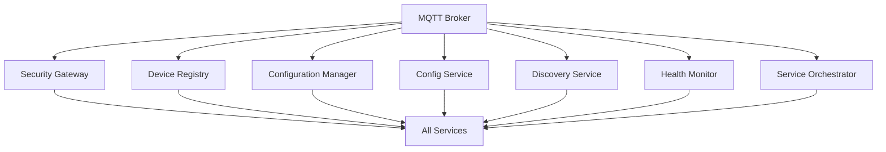
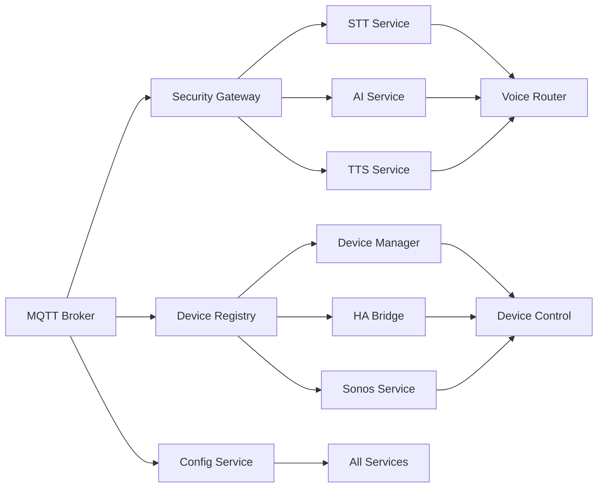

# 🕸️ Service Dependencies MOC

**Map of Content for Alicia Service Dependencies and Relationships**

## 🎯 **Overview**

This MOC provides a comprehensive view of how all 23 Alicia services depend on each other, their communication patterns, and the critical paths through the system. Understanding these dependencies is crucial for troubleshooting, scaling, and maintaining the system.

## 🏗️ **Dependency Architecture**

### **Core Infrastructure Layer**


### **Service Communication Patterns**

#### **1. MQTT Message Bus (Primary)**
- **Pattern**: Publish/Subscribe
- **Topics**: `alicia/{service}/{action}`
- **Examples**:
  - `alicia/voice/stt/request`
  - `alicia/device/control/command`
  - `alicia/config/update/{service}`

#### **2. HTTP API (Secondary)**
- **Pattern**: REST API
- **Ports**: 8001-8026
- **Examples**:
  - `GET /health` - Health checks
  - `POST /discover` - Service discovery
  - `PUT /config` - Configuration updates

## 🔗 **Service Dependency Matrix**

| Service | Dependencies | Dependents | Critical Path |
|---------|-------------|------------|---------------|
| **MQTT Broker** | None | All Services | 🔴 Critical |
| **Security Gateway** | MQTT Broker | All Services | 🔴 Critical |
| **Device Registry** | MQTT Broker | All Services | 🔴 Critical |
| **Config Service** | MQTT Broker | All Services | 🔴 Critical |
| **Health Monitor** | MQTT Broker | All Services | 🟡 Important |
| **Discovery Service** | MQTT Broker | All Services | 🟡 Important |
| **Service Orchestrator** | MQTT Broker | All Services | 🟡 Important |
| **Configuration Manager** | MQTT Broker | All Services | 🟡 Important |
| **STT Service** | MQTT Broker | Voice Router | 🟢 Standard |
| **AI Service** | MQTT Broker | Voice Router | 🟢 Standard |
| **TTS Service** | MQTT Broker | Voice Router | 🟢 Standard |
| **Voice Router** | MQTT Broker, STT, AI, TTS | Frontend | 🟢 Standard |
| **Device Manager** | MQTT Broker | Device Control | 🟢 Standard |
| **HA Bridge** | MQTT Broker | Device Manager | 🟢 Standard |
| **Sonos Service** | MQTT Broker | Device Manager | 🟢 Standard |
| **Device Control** | MQTT Broker, Device Manager | Frontend | 🟢 Standard |
| **Grok Integration** | MQTT Broker | AI Service | 🟢 Standard |
| **Advanced Voice** | MQTT Broker | Voice Router | 🟢 Standard |
| **Personality System** | MQTT Broker | AI Service | 🟢 Standard |
| **Multi-Language** | MQTT Broker | STT, TTS | 🟢 Standard |
| **Load Balancer** | MQTT Broker | All Services | 🟡 Important |
| **Metrics Collector** | MQTT Broker | All Services | 🟡 Important |
| **Event Scheduler** | MQTT Broker | All Services | 🟢 Standard |

## 🚨 **Critical Dependency Paths**

### **1. Core Infrastructure Path**
```
MQTT Broker → Security Gateway → All Services
```
**Impact**: If MQTT Broker fails, entire system fails
**Mitigation**: MQTT Broker clustering, backup brokers

### **2. Voice Processing Path**
```
MQTT Broker → STT Service → AI Service → TTS Service → Voice Router
```
**Impact**: If any service fails, voice processing stops
**Mitigation**: Service redundancy, fallback mechanisms

### **3. Device Control Path**
```
MQTT Broker → Device Manager → Device Control → Frontend
```
**Impact**: If Device Manager fails, device control stops
**Mitigation**: Device state caching, offline capabilities

### **4. Configuration Management Path**
```
MQTT Broker → Config Service → All Services
```
**Impact**: If Config Service fails, configuration updates stop
**Mitigation**: Configuration caching, fallback configs

## 🔄 **Service Startup Dependencies**

### **Phase 1: Core Infrastructure (Start First)**
1. **MQTT Broker** - Foundation for all communication
2. **Security Gateway** - Authentication and authorization
3. **Device Registry** - Service registration and discovery
4. **Config Service** - Configuration management

### **Phase 2: Management Services (Start Second)**
5. **Configuration Manager** - Configuration distribution
6. **Discovery Service** - Service discovery and topology
7. **Health Monitor** - Health monitoring and alerting
8. **Service Orchestrator** - Service lifecycle management

### **Phase 3: Voice Pipeline (Start Third)**
9. **STT Service** - Speech-to-text processing
10. **AI Service** - Natural language processing
11. **TTS Service** - Text-to-speech synthesis
12. **Voice Router** - Voice pipeline orchestration

### **Phase 4: Device Integration (Start Fourth)**
13. **Device Manager** - Device abstraction and management
14. **HA Bridge** - Home Assistant integration
15. **Sonos Service** - Multi-room audio control
16. **Device Control** - Device command execution
17. **Grok Integration** - xAI Grok API integration

### **Phase 5: Advanced Features (Start Fifth)**
18. **Advanced Voice** - Enhanced voice processing
19. **Personality System** - Character and response management
20. **Multi-Language** - Internationalization support
21. **Load Balancer** - Traffic distribution and load balancing

### **Phase 6: Monitoring & Analytics (Start Last)**
22. **Metrics Collector** - Performance metrics collection
23. **Event Scheduler** - Scheduled task execution

## 🔍 **Dependency Analysis Tools**

### **1. Service Health Monitoring**
```python
# Check service dependencies
def check_service_dependencies(service_name: str) -> Dict[str, Any]:
    """Check if all dependencies for a service are healthy."""
    dependencies = get_service_dependencies(service_name)
    health_status = {}
    
    for dep in dependencies:
        health_status[dep] = check_service_health(dep)
    
    return health_status
```

### **2. Critical Path Analysis**
```python
# Find critical paths through the system
def find_critical_paths() -> List[List[str]]:
    """Find all critical paths through the service dependency graph."""
    critical_paths = []
    
    # Voice processing path
    critical_paths.append([
        "mqtt_broker", "stt_service", "ai_service", 
        "tts_service", "voice_router"
    ])
    
    # Device control path
    critical_paths.append([
        "mqtt_broker", "device_manager", "device_control"
    ])
    
    return critical_paths
```

### **3. Dependency Visualization**


## 🛠️ **Troubleshooting Dependencies**

### **Common Dependency Issues**

#### **1. MQTT Broker Unavailable**
- **Symptoms**: All services fail to start or communicate
- **Impact**: Complete system failure
- **Solution**: Restart MQTT Broker, check network connectivity

#### **2. Security Gateway Unavailable**
- **Symptoms**: Authentication failures, service registration failures
- **Impact**: Services cannot authenticate or communicate securely
- **Solution**: Restart Security Gateway, check certificates

#### **3. Device Registry Unavailable**
- **Symptoms**: Service discovery failures, device registration failures
- **Impact**: Services cannot discover each other or devices
- **Solution**: Restart Device Registry, check database connectivity

#### **4. Config Service Unavailable**
- **Symptoms**: Configuration update failures, service configuration errors
- **Impact**: Services cannot receive configuration updates
- **Solution**: Restart Config Service, check configuration files

### **Dependency Recovery Procedures**

#### **1. Single Service Failure**
```bash
# Check service health
curl http://localhost:PORT/health

# Restart specific service
docker restart alicia_SERVICE_NAME

# Verify dependencies
curl http://localhost:PORT/dependencies
```

#### **2. Multiple Service Failure**
```bash
# Check MQTT Broker
curl http://localhost:1884/health

# Restart core infrastructure
docker restart alicia_mqtt_broker
docker restart alicia_security_gateway
docker restart alicia_device_registry

# Restart dependent services
docker restart alicia_stt_service
docker restart alicia_ai_service
docker restart alicia_tts_service
```

#### **3. Complete System Recovery**
```bash
# Stop all services
docker stop $(docker ps -q --filter "name=alicia")

# Start core infrastructure
docker start alicia_mqtt_broker
sleep 10
docker start alicia_security_gateway
docker start alicia_device_registry
docker start alicia_config_service

# Start remaining services
docker start $(docker ps -aq --filter "name=alicia")
```

## 📊 **Dependency Metrics**

### **Key Metrics to Monitor**
- **Service Availability**: Percentage of time services are available
- **Dependency Health**: Health status of all dependencies
- **Communication Latency**: Time for messages to travel between services
- **Error Propagation**: How errors cascade through dependencies

### **Alerting Rules**
- **Critical Service Down**: Alert if MQTT Broker, Security Gateway, or Device Registry fails
- **Dependency Chain Failure**: Alert if a critical dependency chain fails
- **High Latency**: Alert if communication latency exceeds thresholds
- **Error Rate Spike**: Alert if error rates spike in dependent services

## 🎯 **Best Practices**

### **1. Dependency Management**
- **Minimize Dependencies**: Keep dependencies to a minimum
- **Loose Coupling**: Use message bus for loose coupling
- **Dependency Injection**: Use dependency injection for testability
- **Circuit Breakers**: Implement circuit breakers for fault tolerance

### **2. Service Design**
- **Single Responsibility**: Each service should have one clear purpose
- **Stateless Design**: Services should be stateless when possible
- **Graceful Degradation**: Services should degrade gracefully when dependencies fail
- **Health Checks**: Implement comprehensive health checks

### **3. Monitoring and Alerting**
- **Dependency Monitoring**: Monitor all service dependencies
- **Proactive Alerting**: Alert before failures occur
- **Root Cause Analysis**: Track dependency failures to root causes
- **Performance Tracking**: Monitor dependency performance impact

## 🔗 **Related MOCs**

- **[[Architecture MOC]]** - Overall system architecture
- **[[Voice Pipeline MOC]]** - Voice processing dependencies
- **[[Technical MOC]]** - Technical implementation details
- **[[Troubleshooting MOC]]** - Common issues and solutions

## 📚 **Additional Resources**

- **[[Service Communication Patterns]]** - How services communicate
- **[[Health Monitoring Guide]]** - Monitoring service health
- **[[Deployment Guide]]** - Service deployment procedures
- **[[Performance Optimization]]** - Optimizing service performance

---

**This MOC provides a comprehensive understanding of service dependencies and relationships in the Alicia system. Use it to troubleshoot issues, plan deployments, and optimize system performance.**
