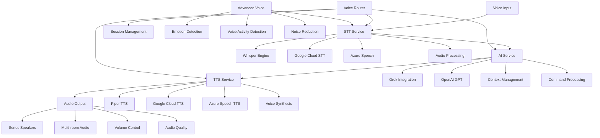

# 🎤 Voice Pipeline MOC (Map of Content)

> **MOC**: Map of Content - Your complete guide to Alicia's voice processing system

## 🎯 **What is the Voice Pipeline?**

The Voice Pipeline is Alicia's **core intelligence system** that transforms your spoken words into smart home actions. It's like having a conversation with your home - you speak, Alicia understands, and your home responds.

## 🧠 **Voice Pipeline Knowledge Graph**



## 🎯 **Core Components**

### **🎤 Speech-to-Text (STT)**
- **[[STT Service Implementation]]** - Complete STT service analysis
- **[[Whisper Integration]]** - Local AI speech recognition
- **[[Cloud STT Services]]** - Google Cloud and Azure integration
- **[[Audio Processing]]** - Audio preprocessing and optimization
- **[[Multi-Language STT]]** - Support for 9 languages

### **🧠 AI Processing**
- **[[AI Service & Grok Integration]]** - Natural language understanding
- **[[Command Processing]]** - Converting speech to actions
- **[[Context Management]]** - Conversation memory and context
- **[[Intent Recognition]]** - Understanding what you want
- **[[Response Generation]]** - Creating appropriate responses

### **🔊 Text-to-Speech (TTS)**
- **[[TTS Service Implementation]]** - Complete TTS service analysis
- **[[Piper TTS]]** - High-quality local voice synthesis
- **[[Cloud TTS Services]]** - Google Cloud and Azure integration
- **[[Voice Customization]]** - Different voices and personalities
- **[[Multi-Language TTS]]** - Voice synthesis in multiple languages

### **🎛️ Voice Router**
- **[[Voice Router Implementation]]** - Pipeline orchestration
- **[[Session Management]]** - Managing voice conversations
- **[[Pipeline Coordination]]** - Coordinating all voice services
- **[[Error Handling]]** - Managing voice processing errors
- **[[Performance Optimization]]** - Optimizing voice processing speed

## 🎮 **User Experience**

### **🎯 Basic Voice Commands**
- **[[First Voice Command]]** - Say hello to Alicia
- **[[Voice Commands 101]]** - Master voice control
- **[[Room-Specific Commands]]** - Control different spaces
- **[[Device Control Commands]]** - Control smart devices

### **🎤 Advanced Voice Features**
- **[[Custom Commands]]** - Create your own voice shortcuts
- **[[Scene Commands]]** - Set perfect moods with voice
- **[[Multi-Language Commands]]** - Speak in your language
- **[[Personality Commands]]** - Interact with different AI personalities

### **🎨 Voice Customization**
- **[[Personalities & Moods]]** - Choose your AI assistant
- **[[Voice Settings]]** - Customize voice responses
- **[[Language Settings]]** - Set your preferred language
- **[[Audio Settings]]** - Adjust volume and quality

## 🔧 **Technical Deep Dive**

### **🏗️ STT Architecture**
- **[[STT Service Design]]** - Service architecture and design
- **[[Audio Processing Pipeline]]** - How audio is processed
- **[[Engine Selection]]** - Choosing the right STT engine
- **[[Performance Optimization]]** - Optimizing STT performance
- **[[Error Handling]]** - Managing STT errors and fallbacks

### **🧠 AI Processing Architecture**
- **[[AI Service Design]]** - AI service architecture
- **[[Grok Integration]]** - xAI Grok API integration
- **[[Context Management]]** - Conversation context handling
- **[[Command Processing]]** - Converting speech to actions
- **[[Response Generation]]** - Creating appropriate responses

### **🔊 TTS Architecture**
- **[[TTS Service Design]]** - TTS service architecture
- **[[Voice Synthesis Pipeline]]** - How text becomes speech
- **[[Voice Customization]]** - Different voices and styles
- **[[Audio Output Management]]** - Managing audio output
- **[[Quality Optimization]]** - Optimizing voice quality

### **🎛️ Pipeline Orchestration**
- **[[Voice Router Design]]** - Router service architecture
- **[[Session Management]]** - Managing voice sessions
- **[[Pipeline Coordination]]** - Coordinating all services
- **[[Error Recovery]]** - Handling pipeline failures
- **[[Performance Monitoring]]** - Monitoring pipeline performance

## 🎨 **Visual Learning**

### **📊 Voice Pipeline Diagrams**
- **[[Voice Flow Diagram]]** - Complete voice processing flow
- **[[STT Architecture Diagram]]** - Speech-to-text architecture
- **[[AI Processing Diagram]]** - AI processing architecture
- **[[TTS Architecture Diagram]]** - Text-to-speech architecture

### **🎨 Concept Drawings**
- **[[Voice Pipeline Concept]]** - Visual voice processing concept
- **[[Audio Processing Concept]]** - Audio processing visualization
- **[[AI Understanding Concept]]** - AI understanding visualization
- **[[Voice Output Concept]]** - Voice output visualization

### **📈 Process Flows**
- **[[Voice Command Flow]]** - From speech to action
- **[[Error Handling Flow]]** - Voice processing error handling
- **[[Multi-Language Flow]]** - Multi-language processing
- **[[Session Management Flow]]** - Voice session management

## 🔍 **Quick Reference**

### **🎤 Voice Commands**
- **[[Basic Commands]]** - Essential voice commands
- **[[Advanced Commands]]** - Complex voice interactions
- **[[Custom Commands]]** - Create your own commands
- **[[Command Reference]]** - Complete command list

### **🔧 Technical Reference**
- **[[STT API Reference]]** - STT service APIs
- **[[AI API Reference]]** - AI service APIs
- **[[TTS API Reference]]** - TTS service APIs
- **[[Router API Reference]]** - Voice router APIs

### **⚙️ Configuration**
- **[[STT Configuration]]** - STT service settings
- **[[AI Configuration]]** - AI service settings
- **[[TTS Configuration]]** - TTS service settings
- **[[Router Configuration]]** - Voice router settings

### **🚨 Troubleshooting**
- **[[Voice Issues]]** - Common voice problems
- **[[STT Problems]]** - Speech recognition issues
- **[[AI Problems]]** - AI processing issues
- **[[TTS Problems]]** - Voice synthesis issues

## 📊 **Dynamic Content**

### **📋 Voice Service Status**
```dataview
TABLE status, response_time, accuracy
FROM "voice-services"
WHERE status != null
SORT response_time ASC
```

### **📊 Voice Performance Metrics**
```dataview
TABLE stt_accuracy, ai_response_time, tts_quality
FROM "voice-metrics"
WHERE timestamp > date(today) - dur(1 day)
SORT timestamp DESC
```

### **🎯 Voice Commands Usage**
```dataview
TABLE command, usage_count, success_rate
FROM "voice-commands"
WHERE usage_count > 0
SORT usage_count DESC
```

## 🎯 **Learning Paths**

### **🎤 For Voice Enthusiasts**
1. **Start**: [[First Voice Command]]
2. **Learn**: [[Voice Commands 101]]
3. **Explore**: [[Advanced Voice Features]]
4. **Master**: [[Custom Commands]]

### **🔧 For Developers**
1. **Start**: [[Voice Pipeline Architecture]]
2. **Learn**: [[STT Service Implementation]]
3. **Explore**: [[AI Service & Grok Integration]]
4. **Master**: [[TTS Service Implementation]]

### **🎨 For Visual Learners**
1. **Start**: [[Voice Pipeline Diagrams]]
2. **Learn**: [[Concept Drawings]]
3. **Explore**: [[Process Flows]]
4. **Master**: [[Visual Learning]]

## 🚀 **Advanced Features**

### **🧠 Advanced Voice Processing**
- **[[Emotion Detection]]** - Detecting emotions in speech
- **[[Voice Activity Detection]]** - Detecting when you're speaking
- **[[Noise Reduction]]** - Reducing background noise
- **[[Speaker Diarization]]** - Identifying different speakers
- **[[Audio Quality Assessment]]** - Assessing audio quality

### **🌍 Multi-Language Support**
- **[[Language Detection]]** - Automatic language detection
- **[[Real-time Translation]]** - Translating between languages
- **[[Cultural Adaptation]]** - Adapting to cultural contexts
- **[[Voice Synthesis]]** - Voice synthesis in multiple languages
- **[[Accent Recognition]]** - Recognizing different accents

### **🎭 Personality Integration**
- **[[Personality System]]** - AI personality management
- **[[Response Customization]]** - Customizing AI responses
- **[[Emotional Intelligence]]** - AI emotional understanding
- **[[Conversation Style]]** - Adapting conversation style
- **[[Mood Detection]]** - Detecting user mood and adapting

## 🎯 **Performance Optimization**

### **⚡ Speed Optimization**
- **[[Response Time Optimization]]** - Reducing voice response time
- **[[Pipeline Optimization]]** - Optimizing voice pipeline
- **[[Caching Strategies]]** - Caching voice processing results
- **[[Load Balancing]]** - Balancing voice processing load
- **[[Resource Management]]** - Managing voice processing resources

### **🎯 Accuracy Optimization**
- **[[STT Accuracy]]** - Improving speech recognition accuracy
- **[[AI Understanding]]** - Improving AI understanding
- **[[TTS Quality]]** - Improving voice synthesis quality
- **[[Error Reduction]]** - Reducing voice processing errors
- **[[Quality Monitoring]]** - Monitoring voice quality

## 🎉 **What Makes This Special**

### **🧠 Intelligent Processing**
- **Multi-engine STT** with automatic fallback
- **Advanced AI** with context awareness
- **High-quality TTS** with multiple voices
- **Intelligent routing** for optimal performance

### **🎨 User Experience**
- **Natural conversation** with your home
- **Multi-language support** for global users
- **Personality customization** for personal touch
- **Seamless integration** with smart devices

### **🔧 Technical Excellence**
- **Microservices architecture** for scalability
- **Real-time processing** for instant responses
- **Error handling** for reliability
- **Performance monitoring** for optimization

## 🎯 **Next Steps**

1. **Explore the links** above to dive deeper
2. **Use the graph view** to see connections
3. **Follow a learning path** that interests you
4. **Create your own notes** and annotations
5. **Share insights** with the community

---

**Welcome to the voice processing universe! 🎤**

*This MOC is your complete guide to understanding and mastering Alicia's voice processing system. Use it to explore, learn, and discover the fascinating world of voice AI.*
